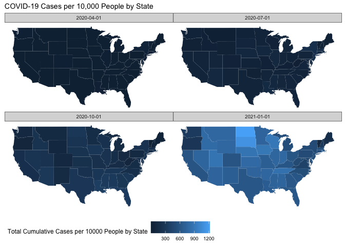

```r
library(tidyverse)     # for data cleaning and plotting
```

```
## ── Attaching packages ─────────────────────────────────────── tidyverse 1.3.0 ──
```

```
## ✓ ggplot2 3.3.2     ✓ purrr   0.3.4
## ✓ tibble  3.0.5     ✓ dplyr   1.0.2
## ✓ tidyr   1.1.2     ✓ stringr 1.4.0
## ✓ readr   1.4.0     ✓ forcats 0.5.0
```

```
## ── Conflicts ────────────────────────────────────────── tidyverse_conflicts() ──
## x dplyr::filter() masks stats::filter()
## x dplyr::lag()    masks stats::lag()
```

```r
library(lubridate)     # for date manipulation
```

```
## 
## Attaching package: 'lubridate'
```

```
## The following objects are masked from 'package:base':
## 
##     date, intersect, setdiff, union
```

```r
library(openintro)     # for the abbr2state() function
```

```
## Loading required package: airports
```

```
## Loading required package: cherryblossom
```

```
## Loading required package: usdata
```

```r
library(palmerpenguins)# for Palmer penguin data
library(maps)          # for map data
```

```
## 
## Attaching package: 'maps'
```

```
## The following object is masked from 'package:purrr':
## 
##     map
```

```r
library(ggmap)         # for mapping points on maps
```

```
## Google's Terms of Service: https://cloud.google.com/maps-platform/terms/.
```

```
## Please cite ggmap if you use it! See citation("ggmap") for details.
```

```r
library(gplots)        # for col2hex() function
```

```
## 
## Attaching package: 'gplots'
```

```
## The following object is masked from 'package:stats':
## 
##     lowess
```

```r
library(RColorBrewer)  # for color palettes
library(sf)            # for working with spatial data
```

```
## Linking to GEOS 3.8.1, GDAL 3.1.4, PROJ 6.3.1
```

```r
library(leaflet)       # for highly customizable mapping
library(carData)       # for Minneapolis police stops data
library(ggthemes)      # for more themes (including theme_map())
theme_set(theme_minimal())
```


```r
# Starbucks locations
Starbucks <- read_csv("https://www.macalester.edu/~ajohns24/Data/Starbucks.csv")
```

```
## 
## ── Column specification ────────────────────────────────────────────────────────
## cols(
##   Brand = col_character(),
##   `Store Number` = col_character(),
##   `Store Name` = col_character(),
##   `Ownership Type` = col_character(),
##   `Street Address` = col_character(),
##   City = col_character(),
##   `State/Province` = col_character(),
##   Country = col_character(),
##   Postcode = col_character(),
##   `Phone Number` = col_character(),
##   Timezone = col_character(),
##   Longitude = col_double(),
##   Latitude = col_double()
## )
```

```r
starbucks_us_by_state <- Starbucks %>% 
  filter(Country == "US") %>% 
  count(`State/Province`) %>% 
  mutate(state_name = str_to_lower(abbr2state(`State/Province`))) 

# Lisa's favorite St. Paul places - example for you to create your own data
favorite_stp_by_lisa <- tibble(
  place = c("Home", "Macalester College", "Adams Spanish Immersion", 
            "Spirit Gymnastics", "Bama & Bapa", "Now Bikes",
            "Dance Spectrum", "Pizza Luce", "Brunson's"),
  long = c(-93.1405743, -93.1712321, -93.1451796, 
           -93.1650563, -93.1542883, -93.1696608, 
           -93.1393172, -93.1524256, -93.0753863),
  lat = c(44.950576, 44.9378965, 44.9237914,
          44.9654609, 44.9295072, 44.9436813, 
          44.9399922, 44.9468848, 44.9700727)
  )

#COVID-19 data from the New York Times
covid19 <- read_csv("https://raw.githubusercontent.com/nytimes/covid-19-data/master/us-states.csv")
```

```
## 
## ── Column specification ────────────────────────────────────────────────────────
## cols(
##   date = col_date(format = ""),
##   state = col_character(),
##   fips = col_character(),
##   cases = col_double(),
##   deaths = col_double()
## )
```

## Put your homework on GitHub!

If you were not able to get set up on GitHub last week, go [here](https://github.com/llendway/github_for_collaboration/blob/master/github_for_collaboration.md) and get set up first. Then, do the following (if you get stuck on a step, don't worry, I will help! You can always get started on the homework and we can figure out the GitHub piece later):

* Create a repository on GitHub, giving it a nice name so you know it is for the 4th weekly exercise assignment (follow the instructions in the document/video).  
* Copy the repo name so you can clone it to your computer. In R Studio, go to file --> New project --> Version control --> Git and follow the instructions from the document/video.  
* Download the code from this document and save it in the repository folder/project on your computer.  
* In R Studio, you should then see the .Rmd file in the upper right corner in the Git tab (along with the .Rproj file and probably .gitignore).  
* Check all the boxes of the files in the Git tab under Stage and choose commit.  
* In the commit window, write a commit message, something like "Initial upload" would be appropriate, and commit the files.  
* Either click the green up arrow in the commit window or close the commit window and click the green up arrow in the Git tab to push your changes to GitHub.  
* Refresh your GitHub page (online) and make sure the new documents have been pushed out.  
* Back in R Studio, knit the .Rmd file. When you do that, you should have two (as long as you didn't make any changes to the .Rmd file, in which case you might have three) files show up in the Git tab - an .html file and an .md file. The .md file is something we haven't seen before and is here because I included `keep_md: TRUE` in the YAML heading. The .md file is a markdown (NOT R Markdown) file that is an interim step to creating the html file. They are displayed fairly nicely in GitHub, so we want to keep it and look at it there. Click the boxes next to these two files, commit changes (remember to include a commit message), and push them (green up arrow).  
* As you work through your homework, save and commit often, push changes occasionally (maybe after you feel finished with an exercise?), and go check to see what the .md file looks like on GitHub.  
* If you have issues, let me know! This is new to many of you and may not be intuitive at first. But, I promise, you'll get the hang of it! 


## Instructions

* Put your name at the top of the document. 

* **For ALL graphs, you should include appropriate labels.** 

* Feel free to change the default theme, which I currently have set to `theme_minimal()`. 

* Use good coding practice. Read the short sections on good code with [pipes](https://style.tidyverse.org/pipes.html) and [ggplot2](https://style.tidyverse.org/ggplot2.html). **This is part of your grade!**

* When you are finished with ALL the exercises, uncomment the options at the top so your document looks nicer. Don't do it before then, or else you might miss some important warnings and messages.


## Warm-up exercises from tutorial

These exercises will reiterate what you learned in the "Mapping data with R" tutorial. If you haven't gone through the tutorial yet, you should do that first.

### Starbucks locations (`ggmap`)

  1. Add the `Starbucks` locations to a world map. Add an aesthetic to the world map that sets the color of the points according to the ownership type. What, if anything, can you deduce from this visualization?  
  

```r
world <- get_stamenmap(
    bbox = c(left = -180, bottom = -57, right = 179, top = 82.1), 
    maptype = "terrain",
    zoom = 2)
```

```
## Source : http://tile.stamen.com/terrain/2/0/0.png
```

```
## Source : http://tile.stamen.com/terrain/2/1/0.png
```

```
## Source : http://tile.stamen.com/terrain/2/2/0.png
```

```
## Source : http://tile.stamen.com/terrain/2/3/0.png
```

```
## Source : http://tile.stamen.com/terrain/2/0/1.png
```

```
## Source : http://tile.stamen.com/terrain/2/1/1.png
```

```
## Source : http://tile.stamen.com/terrain/2/2/1.png
```

```
## Source : http://tile.stamen.com/terrain/2/3/1.png
```

```
## Source : http://tile.stamen.com/terrain/2/0/2.png
```

```
## Source : http://tile.stamen.com/terrain/2/1/2.png
```

```
## Source : http://tile.stamen.com/terrain/2/2/2.png
```

```
## Source : http://tile.stamen.com/terrain/2/3/2.png
```

```r
Starbucks_Clean <- Starbucks %>% 
  rename(ownership_type = `Ownership Type`)
  
ggmap(world) + 
  geom_point(data = Starbucks_Clean, 
             aes(x = Longitude, 
                 y = Latitude, 
                 color = ownership_type), 
             alpha = .4, 
             size = .1) 
```

```
## Warning: Removed 1 rows containing missing values (geom_point).
```

<!-- -->


  2. Construct a new map of Starbucks locations in the Twin Cities metro area (approximately the 5 county metro area).  
  

```r
twin_cities <- get_stamenmap(
    bbox = c(left = -93.5, bottom = 44.8, right = -92.8, top = 45.2), 
    maptype = "terrain",
    zoom = 11)
```

```
## Source : http://tile.stamen.com/terrain/11/492/735.png
```

```
## Source : http://tile.stamen.com/terrain/11/493/735.png
```

```
## Source : http://tile.stamen.com/terrain/11/494/735.png
```

```
## Source : http://tile.stamen.com/terrain/11/495/735.png
```

```
## Source : http://tile.stamen.com/terrain/11/496/735.png
```

```
## Source : http://tile.stamen.com/terrain/11/492/736.png
```

```
## Source : http://tile.stamen.com/terrain/11/493/736.png
```

```
## Source : http://tile.stamen.com/terrain/11/494/736.png
```

```
## Source : http://tile.stamen.com/terrain/11/495/736.png
```

```
## Source : http://tile.stamen.com/terrain/11/496/736.png
```

```
## Source : http://tile.stamen.com/terrain/11/492/737.png
```

```
## Source : http://tile.stamen.com/terrain/11/493/737.png
```

```
## Source : http://tile.stamen.com/terrain/11/494/737.png
```

```
## Source : http://tile.stamen.com/terrain/11/495/737.png
```

```
## Source : http://tile.stamen.com/terrain/11/496/737.png
```

```
## Source : http://tile.stamen.com/terrain/11/492/738.png
```

```
## Source : http://tile.stamen.com/terrain/11/493/738.png
```

```
## Source : http://tile.stamen.com/terrain/11/494/738.png
```

```
## Source : http://tile.stamen.com/terrain/11/495/738.png
```

```
## Source : http://tile.stamen.com/terrain/11/496/738.png
```

```r
Starbucks_TC <- Starbucks_Clean %>% 
  filter(Country == "US",
         `State/Province` == "MN")

ggmap(twin_cities) + 
  geom_point(data = Starbucks_TC, 
             aes(x = Longitude, 
                 y = Latitude))  
```

```
## Warning: Removed 64 rows containing missing values (geom_point).
```

<!-- -->


  3. In the Twin Cities plot, play with the zoom number. What does it do?  (just describe what it does - don't actually include more than one map).  

  4. Try a couple different map types (see `get_stamenmap()` in help and look at `maptype`). Include a map with one of the other map types. 
  

```r
twin_cities2 <- get_stamenmap(
    bbox = c(left = -93.5, bottom = 44.8, right = -92.8, top = 45.2), 
    maptype = "toner-2010",
    zoom = 11)
```

```
## Source : http://tile.stamen.com/toner-2010/11/492/735.png
```

```
## Source : http://tile.stamen.com/toner-2010/11/493/735.png
```

```
## Source : http://tile.stamen.com/toner-2010/11/494/735.png
```

```
## Source : http://tile.stamen.com/toner-2010/11/495/735.png
```

```
## Source : http://tile.stamen.com/toner-2010/11/496/735.png
```

```
## Source : http://tile.stamen.com/toner-2010/11/492/736.png
```

```
## Source : http://tile.stamen.com/toner-2010/11/493/736.png
```

```
## Source : http://tile.stamen.com/toner-2010/11/494/736.png
```

```
## Source : http://tile.stamen.com/toner-2010/11/495/736.png
```

```
## Source : http://tile.stamen.com/toner-2010/11/496/736.png
```

```
## Source : http://tile.stamen.com/toner-2010/11/492/737.png
```

```
## Source : http://tile.stamen.com/toner-2010/11/493/737.png
```

```
## Source : http://tile.stamen.com/toner-2010/11/494/737.png
```

```
## Source : http://tile.stamen.com/toner-2010/11/495/737.png
```

```
## Source : http://tile.stamen.com/toner-2010/11/496/737.png
```

```
## Source : http://tile.stamen.com/toner-2010/11/492/738.png
```

```
## Source : http://tile.stamen.com/toner-2010/11/493/738.png
```

```
## Source : http://tile.stamen.com/toner-2010/11/494/738.png
```

```
## Source : http://tile.stamen.com/toner-2010/11/495/738.png
```

```
## Source : http://tile.stamen.com/toner-2010/11/496/738.png
```

```r
ggmap(twin_cities2) + 
  geom_point(data = Starbucks_TC, 
             aes(x = Longitude, 
                 y = Latitude)) 
```

```
## Warning: Removed 64 rows containing missing values (geom_point).
```

<!-- -->

  

  5. Add a point to the map that indicates Macalester College and label it appropriately. There are many ways you can do think, but I think it's easiest with the `annotate()` function (see `ggplot2` cheatsheet).
  

```r
ggmap(twin_cities2) + 
  geom_point(data = Starbucks_TC, 
             aes(x = Longitude, 
                 y = Latitude), 
              size = .5) +
  annotate("point",
           x = -93.1691, 
           y = 44.9379, 
           label = "Macalester College", 
           color = "Red", 
           size = 3) +
   annotate("text",
           x = -93.1691, 
           y = 44.92, 
           label = "Macalester College", 
           color = "Red", 
           size = 3) 
```

```
## Warning: Ignoring unknown parameters: label
```

```
## Warning: Removed 64 rows containing missing values (geom_point).
```

<!-- -->


### Choropleth maps with Starbucks data (`geom_map()`)

The example I showed in the tutorial did not account for population of each state in the map. In the code below, a new variable is created, `starbucks_per_10000`, that gives the number of Starbucks per 10,000 people. It is in the `starbucks_with_2018_pop_est` dataset.


```r
census_pop_est_2018 <- read_csv("https://www.dropbox.com/s/6txwv3b4ng7pepe/us_census_2018_state_pop_est.csv?dl=1") %>% 
  separate(state, into = c("dot","state"), extra = "merge") %>% 
  select(-dot) %>% 
  mutate(state = str_to_lower(state))
```

```
## 
## ── Column specification ────────────────────────────────────────────────────────
## cols(
##   state = col_character(),
##   est_pop_2018 = col_double()
## )
```

```r
starbucks_with_2018_pop_est <-
  starbucks_us_by_state %>% 
  left_join(census_pop_est_2018,
            by = c("state_name" = "state")) %>% 
  mutate(starbucks_per_10000 = (n/est_pop_2018)*10000)
```

  6. **`dplyr` review**: Look through the code above and describe what each line of code does.

  7. Create a choropleth map that shows the number of Starbucks per 10,000 people on a map of the US. Use a new fill color, add points for all Starbucks in the US (except Hawaii and Alaska), add an informative title for the plot, and include a caption that says who created the plot (you!). Make a conclusion about what you observe.


```r
US_Map <- map_data("state")

Starbucks_US <- Starbucks %>% 
  filter(Country == "US")

Starbucks_US_Points <- starbucks_with_2018_pop_est %>% 
  left_join(Starbucks_US, 
            by = c("State/Province")) %>% 
  filter(!state_name %in% c("alaska", "hawaii"))

Starbucks_US_Points %>% 
  rename(region = state_name) %>% 
  ggplot() +
  geom_map(map = US_Map, 
           aes(map_id = region, 
               fill = starbucks_per_10000)) + 
  scale_fill_gradient(low = "#27251F", high = "#00704A") +
  expand_limits(x = US_Map$long, y = US_Map$lat) + 
  theme_map() +
  geom_point(data = Starbucks_US_Points, 
             aes(x = Longitude, 
                 y = Latitude), 
             color = "grey",
             size = 1, 
             alpha = .5) +
  theme(legend.background = element_blank()) +
  labs(title = "Starbucks per 10,000 People", 
       caption = "Gabriel Reynolds", 
       fill = "Starbucks per 10,000")
```

<!-- -->


### A few of your favorite things (`leaflet`)

  8. In this exercise, you are going to create a single map of some of your favorite places! The end result will be one map that satisfies the criteria below. 

  * Create a data set using the `tibble()` function that has 10-15 rows of your favorite places. The columns will be the name of the location, the latitude, the longitude, and a column that indicates if it is in your top 3 favorite locations or not. For an example of how to use `tibble()`, look at the `favorite_stp_by_lisa` I created in the data R code chunk at the beginning.  

  * Create a `leaflet` map that uses circles to indicate your favorite places. Label them with the name of the place. Choose the base map you like best. Color your 3 favorite places differently than the ones that are not in your top 3 (HINT: `colorFactor()`). Add a legend that explains what the colors mean.  
  
  * Connect all your locations together with a line in a meaningful way (you may need to order them differently in the original data).  
  
  * If there are other variables you want to add that could enhance your plot, do that now.  
  

```r
favorite_places <- tibble(
  name = c("minnehaha_falls", "saint_anthony_falls", "como_park", "art_institute", "grand_marais", "door_county", "duluth", "aster_cafe", "bell_museum", "pike_island"), 
  long = c(-93.209, -93.255848, -93.154268, -93.274030, -90.337863, -87.194083, -92.097201, -93.255249, -93.187747, -93.166682), 
  lat = c(44.915001, 44.982000, 44.982330, 44.958326, 47.751534, 44.985930, 46.788668, 44.984456, 44.991583, 44.891313),
  top_3 = c(TRUE, FALSE, FALSE, TRUE, TRUE, FALSE, FALSE, FALSE, FALSE, FALSE)
)

pal <- colorNumeric(palette=c("cornflowerblue", "darkgoldenrod1"), 
                     domain = favorite_places$top_3)

leaflet(favorite_places) %>% 
  addTiles() %>% 
  addCircles(label = ~name,
             color = ~pal(top_3)) %>% 
  addLegend("topleft", colors="darkgoldenrod1", values = ~top_3, bins=1, labels="Top 3 Favorite Places") %>%
  addPolylines(lng=c(-93.209, -93.255848, -93.154268, -93.274030, -90.337863, -87.194083, -92.097201, -93.255249, -93.187747, -93.166682),
               lat=c(44.915001, 44.982000, 44.982330, 44.958326, 47.751534, 44.985930, 46.788668, 44.984456, 44.991583, 44.891313),
               color="gray", weight=2)
```

```
## Assuming "long" and "lat" are longitude and latitude, respectively
```

<!--html_preserve--><div id="htmlwidget-a3182471ad14373f5008" style="width:672px;height:480px;" class="leaflet html-widget"></div>
<script type="application/json" data-for="htmlwidget-a3182471ad14373f5008">{"x":{"options":{"crs":{"crsClass":"L.CRS.EPSG3857","code":null,"proj4def":null,"projectedBounds":null,"options":{}}},"calls":[{"method":"addTiles","args":["//{s}.tile.openstreetmap.org/{z}/{x}/{y}.png",null,null,{"minZoom":0,"maxZoom":18,"tileSize":256,"subdomains":"abc","errorTileUrl":"","tms":false,"noWrap":false,"zoomOffset":0,"zoomReverse":false,"opacity":1,"zIndex":1,"detectRetina":false,"attribution":"&copy; <a href=\"http://openstreetmap.org\">OpenStreetMap<\/a> contributors, <a href=\"http://creativecommons.org/licenses/by-sa/2.0/\">CC-BY-SA<\/a>"}]},{"method":"addCircles","args":[[44.915001,44.982,44.98233,44.958326,47.751534,44.98593,46.788668,44.984456,44.991583,44.891313],[-93.209,-93.255848,-93.154268,-93.27403,-90.337863,-87.194083,-92.097201,-93.255249,-93.187747,-93.166682],10,null,null,{"interactive":true,"className":"","stroke":true,"color":["#FFB90F","#6495ED","#6495ED","#FFB90F","#FFB90F","#6495ED","#6495ED","#6495ED","#6495ED","#6495ED"],"weight":5,"opacity":0.5,"fill":true,"fillColor":["#FFB90F","#6495ED","#6495ED","#FFB90F","#FFB90F","#6495ED","#6495ED","#6495ED","#6495ED","#6495ED"],"fillOpacity":0.2},null,null,["minnehaha_falls","saint_anthony_falls","como_park","art_institute","grand_marais","door_county","duluth","aster_cafe","bell_museum","pike_island"],{"interactive":false,"permanent":false,"direction":"auto","opacity":1,"offset":[0,0],"textsize":"10px","textOnly":false,"className":"","sticky":true},null,null]},{"method":"addLegend","args":[{"colors":["darkgoldenrod1"],"labels":["Top 3 Favorite Places"],"na_color":null,"na_label":"NA","opacity":0.5,"position":"topleft","type":"unknown","title":null,"extra":null,"layerId":null,"className":"info legend","group":null}]},{"method":"addPolylines","args":[[[[{"lng":[-93.209,-93.255848,-93.154268,-93.27403,-90.337863,-87.194083,-92.097201,-93.255249,-93.187747,-93.166682],"lat":[44.915001,44.982,44.98233,44.958326,47.751534,44.98593,46.788668,44.984456,44.991583,44.891313]}]]],null,null,{"interactive":true,"className":"","stroke":true,"color":"gray","weight":2,"opacity":0.5,"fill":false,"fillColor":"gray","fillOpacity":0.2,"smoothFactor":1,"noClip":false},null,null,null,{"interactive":false,"permanent":false,"direction":"auto","opacity":1,"offset":[0,0],"textsize":"10px","textOnly":false,"className":"","sticky":true},null]}],"limits":{"lat":[44.891313,47.751534],"lng":[-93.27403,-87.194083]}},"evals":[],"jsHooks":[]}</script><!--/html_preserve-->

  
## Revisiting old datasets

This section will revisit some datasets we have used previously and bring in a mapping component. 

### Bicycle-Use Patterns

The data come from Washington, DC and cover the last quarter of 2014.

Two data tables are available:

- `Trips` contains records of individual rentals
- `Stations` gives the locations of the bike rental stations

Here is the code to read in the data. We do this a little differently than usualy, which is why it is included here rather than at the top of this file. To avoid repeatedly re-reading the files, start the data import chunk with `{r cache = TRUE}` rather than the usual `{r}`. This code reads in the large dataset right away.


```r
data_site <- 
  "https://www.macalester.edu/~dshuman1/data/112/2014-Q4-Trips-History-Data.rds" 
Trips <- readRDS(gzcon(url(data_site)))
Stations<-read_csv("http://www.macalester.edu/~dshuman1/data/112/DC-Stations.csv")
```

```
## 
## ── Column specification ────────────────────────────────────────────────────────
## cols(
##   name = col_character(),
##   lat = col_double(),
##   long = col_double(),
##   nbBikes = col_double(),
##   nbEmptyDocks = col_double()
## )
```

  9. Use the latitude and longitude variables in `Stations` to make a visualization of the total number of departures from each station in the `Trips` data. Use either color or size to show the variation in number of departures. This time, plot the points on top of a map. Use any of the mapping tools you'd like.
  

```r
Trips2 <- Trips %>% 
  group_by(sstation) %>% 
  summarize(n_departures = n()) %>% 
  arrange(desc(n_departures)) %>% 
  left_join(Stations, 
            by = c("sstation"="name")) 
```

```
## `summarise()` ungrouping output (override with `.groups` argument)
```

```r
pal2 <- colorBin(palette="YlGnBu",
                 domain = Trips2$n_departures,
                 bins=6)

leaflet(Trips2) %>% 
  addProviderTiles(providers$Stamen.Toner) %>% 
  addCircles(label = ~sstation, 
             color = ~pal2(n_departures), 
             opacity = 1) %>% 
  addLegend("topleft", values = ~n_departures, pal=pal2, bins=6, title="Number of Station Departures")
```

```
## Assuming "long" and "lat" are longitude and latitude, respectively
```

```
## Warning in validateCoords(lng, lat, funcName): Data contains 12 rows with either
## missing or invalid lat/lon values and will be ignored
```

```
## Warning in addLegend(., "topleft", values = ~n_departures, pal = pal2, bins =
## 6, : 'bins' is ignored because the palette type is not numeric
```

<!--html_preserve--><div id="htmlwidget-fa5b1ed991b276285ed6" style="width:672px;height:480px;" class="leaflet html-widget"></div>
<script type="application/json" data-for="htmlwidget-fa5b1ed991b276285ed6">{"x":{"options":{"crs":{"crsClass":"L.CRS.EPSG3857","code":null,"proj4def":null,"projectedBounds":null,"options":{}}},"calls":[{"method":"addProviderTiles","args":["Stamen.Toner",null,null,{"errorTileUrl":"","noWrap":false,"detectRetina":false}]},{"method":"addCircles","args":[[38.89696,38.9101,38.888251,38.9059,38.90985,38.91554,38.9176,38.888553,38.9121,38.884,38.922925,38.897446,38.9154,38.9308,38.912682,38.908142,38.9057,38.8997,38.90304,38.90093,38.905607,38.9086,38.926088,38.923583,38.9268,38.90534,38.90276,38.90572,38.879819,38.888767,38.912719,38.900412,38.916787,38.9155,38.90088,38.906602,38.8991,38.887299,38.903827,38.908905,38.929464,38.921074,38.9319,38.918809,38.905126,38.898364,38.894514,38.917761,38.8767,38.90268,null,38.902061,38.894758,38.886266,38.92333,38.89968,38.903819,38.90774,38.9126,38.920669,38.898069,38.905707,38.904742,38.89841,38.886952,38.889955,38.915417,38.9008,38.887378,38.88731,38.897222,38.936043,38.894832,38.90375,38.9172,38.9003,38.8851,38.900283,38.894851,38.88412,38.893028,38.894573,38.887237,38.902,38.87861,38.897857,38.8923,38.9066,38.892275,38.897274,38.90381,38.8963,38.897324,38.899632,38.903407,38.899972,38.901755,38.9022212,38.895914,38.897315,38.928156,38.9003,38.90849,38.889988,38.8573,38.899408,38.90706,38.917622,38.912659,38.9375,38.899983,38.88412,38.892459,38.901539,38.902204,38.881185,38.898404,38.884,38.903584,38.947607,38.88732,38.894919,null,38.922649,38.8803,38.895344,38.900358,38.910972,38.899703,38.889908,38.930282,38.934267,38.916442,null,38.814577,38.882788,38.90509,38.8763,38.891696,38.975219,38.8946,38.897195,38.881044,38.920387,38.923203,38.912648,38.87501,38.8896,38.887312,38.805767,38.903582,38.918155,38.88992,38.900413,38.944551,38.903732,38.9418,38.862303,38.922581,38.9249,null,38.938736,38.8792,38.88786,38.848441,38.943837,38.934751,38.89593,38.8952,38.942016,38.894722,38.955016,38.919077,38.880151,38.941154,38.8533,38.87675,38.984691,38.8904,38.895184,38.8637,38.893648,38.956432,38.927872,38.897612,38.889,38.885801,38.928743,38.8564,38.878433,38.804718,38.882629,38.932514,38.896923,38.86017,38.802677,38.805317,38.876393,38.8426,38.89054,38.8629,38.871822,38.884616,38.8881,38.893241,38.884734,38.961763,38.8743,38.857866,38.88397,38.947774,38.894941,38.949662,38.9346,38.977933,38.810743,38.896015,null,38.87887,38.889365,38.863833,38.927497,38.880705,38.892164,38.876737,38.820064,38.869442,38.920682,38.82595,38.883921,38.803124,38.884961,38.862669,38.8815,38.85725,38.981103,null,38.928644,38.844015,38.975,38.862478,38.805648,38.82175,38.84232,38.98954,38.933668,38.977093,38.8561,38.869418,38.850688,38.956595,38.983525,39.119765,38.820932,null,38.964992,38.908008,38.833077,38.988562,38.992375,38.989724,38.867373,38.867262,38.990249,38.98128,38.811456,38.880834,38.954812,null,38.96115,38.982456,38.96497,38.986743,38.999634,38.859254,38.927095,38.804378,38.863897,null,38.864702,38.801111,38.990639,38.866611,38.952369,null,38.873755,null,38.847977,39.114688,38.873057,38.846222,38.99521,38.992679,38.86646,38.983627,38.856319,38.889935,38.865784,38.834108,38.999388,38.866471,38.8444,39.110314,39.107709,38.897063,38.898984,39.085394,38.894,38.852248,38.844711,null,38.987,39.084379,38.8601,38.839912,38.857803,38.837666,39.094772,38.898536,38.848454,39.084125,38.843222,39.095661,39.096312,39.076331,39.083705,39.103091,38.8692,38.901385,39.000578,38.908473,38.895929,38.860789,39.102212,38.997653,38.854691,38.884085,38.86559,39.099376,38.835213,39.093783,38.878,39.102099,39.094103,39.120045,39.123513,39.097636],[-77.00493,-77.0444,-77.049426,-77.0325,-77.034438,-77.03818,-77.0321,-77.032429,-77.0387,-76.995397,-77.042581,-77.009888,-77.0446,-77.0315,-77.031681,-77.038359,-77.0056,-77.023086,-77.019027,-77.018677,-77.027137,-77.0323,-77.036536,-77.050046,-77.0322,-77.046774,-77.03863,-77.022264,-77.037413,-77.02858,-77.022155,-77.001949,-77.028139,-77.0222,-77.048911,-77.038785,-77.0337,-77.018939,-77.053485,-77.04478,-77.027822,-77.031887,-77.0388,-77.041571,-77.056887,-77.027869,-77.031617,-77.04062,-77.0178,-77.02674,null,-77.038322,-76.997114,-77.022241,-77.0352,-77.041539,-77.0284,-77.071652,-77.0135,-77.04368,-77.031823,-77.003041,-77.041606,-77.039624,-76.996806,-77.000349,-77.012289,-77.047,-77.001955,-77.01397,-77.019347,-77.024649,-76.987633,-77.06269,-77.0259,-76.9882,-77.0023,-77.029822,-77.02324,-77.017445,-77.026013,-77.01994,-77.028226,-77.03353,-77.006004,-77.026975,-77.0436,-77.05152,-77.013917,-76.994749,-77.034931,-77.045,-77.022322,-77.031686,-77.043648,-76.998347,-77.051084,-77.059219,-77.026064,-77.070993,-77.02344,-77.0429,-77.063586,-76.995193,-77.0511,-77.015289,-77.015231,-77.01597,-77.017669,-77.0328,-76.991383,-77.04657,-77.046567,-77.046564,-77.04337,-77.001828,-77.024281,-76.9861,-77.044789,-77.079382,-76.983569,-77.046587,null,-77.077271,-76.9862,-77.016106,-77.012108,-77.00495,-77.008911,-76.983326,-77.055599,-77.057979,-77.0682,null,-77.052808,-77.103148,-76.9941,-77.0037,-77.0846,-77.016855,-77.072305,-76.983575,-77.111768,-77.025672,-77.047637,-77.041834,-77.0024,-76.9769,-77.025762,-77.06072,-77.067786,-77.004746,-77.071301,-76.982872,-77.063896,-76.987211,-77.0251,-77.059936,-77.070334,-77.0222,null,-77.087171,-76.9953,-77.094875,-77.051516,-77.077078,-77.074647,-77.089006,-77.0436,-77.032652,-77.045128,-77.069956,-77.000648,-77.107673,-77.062036,-77.0498,-77.02127,-77.094537,-77.0889,-77.054845,-77.0633,-77.076701,-77.032947,-77.043358,-77.080851,-77.0925,-77.097745,-77.012457,-77.0492,-77.03023,-77.043363,-77.109366,-76.992889,-77.086502,-77.049593,-77.063562,-77.049883,-77.107735,-77.0502,-77.08095,-77.0528,-77.107906,-77.10108,-77.09308,-77.086045,-77.093485,-77.085998,-77.0057,-77.05949,-77.10783,-77.032818,-77.09169,-77.027333,-76.9955,-77.006472,-77.044664,-77.078107,null,-77.1207,-77.077294,-77.080319,-76.997194,-77.08596,-77.079375,-76.994468,-77.057619,-77.104503,-76.995876,-77.058541,-77.116817,-77.040363,-77.08777,-76.994637,-77.10396,-77.05332,-77.097426,null,-76.990955,-77.050537,-77.01121,-77.086599,-77.05293,-77.047494,-77.089555,-77.098029,-76.991016,-77.094589,-77.0512,-77.095596,-77.05152,-77.019815,-77.095367,-77.166093,-77.053096,null,-77.103381,-76.996985,-77.059821,-77.096539,-77.100104,-77.023854,-76.988039,-77.072315,-77.02935,-77.011336,-77.050276,-77.091129,-77.082426,null,-77.088659,-77.091991,-77.075946,-77.000035,-77.109647,-77.063275,-76.978924,-77.060866,-76.990037,null,-77.048672,-77.068952,-77.100239,-76.985238,-77.002721,null,-77.089233,null,-77.075104,-77.171487,-76.971015,-77.069275,-77.02918,-77.029457,-77.04826,-77.006311,-77.11153,-76.93723,-76.9784,-77.087323,-77.031555,-77.076131,-77.085931,-77.182669,-77.152072,-76.947446,-77.078317,-77.145803,-76.947974,-77.105022,-76.987823,null,-77.029417,-77.146866,-76.9672,-77.087083,-77.086733,-77.09482,-77.145213,-76.931862,-77.084918,-77.151291,-76.999388,-77.159048,-77.192672,-77.141378,-77.149443,-77.196442,-76.9599,-76.941877,-77.00149,-76.933099,-77.105246,-77.09586,-77.177091,-77.034499,-77.100555,-76.957461,-76.952103,-77.188014,-77.094295,-77.202501,-76.9607,-77.200322,-77.132954,-77.156985,-77.15741,-77.196636],10,null,null,{"interactive":true,"className":"","stroke":true,"color":["#0C2C84","#225EA8","#41B6C4","#41B6C4","#41B6C4","#41B6C4","#41B6C4","#41B6C4","#7FCDBB","#7FCDBB","#7FCDBB","#7FCDBB","#7FCDBB","#7FCDBB","#C7E9B4","#C7E9B4","#C7E9B4","#C7E9B4","#C7E9B4","#C7E9B4","#C7E9B4","#C7E9B4","#C7E9B4","#C7E9B4","#C7E9B4","#C7E9B4","#C7E9B4","#C7E9B4","#C7E9B4","#C7E9B4","#C7E9B4","#C7E9B4","#C7E9B4","#C7E9B4","#C7E9B4","#C7E9B4","#C7E9B4","#C7E9B4","#C7E9B4","#C7E9B4","#C7E9B4","#C7E9B4","#C7E9B4","#C7E9B4","#C7E9B4","#C7E9B4","#C7E9B4","#C7E9B4","#C7E9B4","#EDF8B1","#EDF8B1","#EDF8B1","#EDF8B1","#EDF8B1","#EDF8B1","#EDF8B1","#EDF8B1","#EDF8B1","#EDF8B1","#EDF8B1","#EDF8B1","#EDF8B1","#EDF8B1","#EDF8B1","#EDF8B1","#EDF8B1","#EDF8B1","#EDF8B1","#EDF8B1","#EDF8B1","#EDF8B1","#EDF8B1","#EDF8B1","#EDF8B1","#EDF8B1","#EDF8B1","#EDF8B1","#EDF8B1","#EDF8B1","#EDF8B1","#EDF8B1","#EDF8B1","#EDF8B1","#EDF8B1","#EDF8B1","#EDF8B1","#EDF8B1","#EDF8B1","#EDF8B1","#EDF8B1","#EDF8B1","#EDF8B1","#EDF8B1","#EDF8B1","#EDF8B1","#EDF8B1","#EDF8B1","#EDF8B1","#EDF8B1","#EDF8B1","#EDF8B1","#EDF8B1","#EDF8B1","#EDF8B1","#EDF8B1","#EDF8B1","#EDF8B1","#EDF8B1","#EDF8B1","#EDF8B1","#EDF8B1","#EDF8B1","#EDF8B1","#EDF8B1","#EDF8B1","#EDF8B1","#EDF8B1","#EDF8B1","#EDF8B1","#EDF8B1","#EDF8B1","#EDF8B1","#EDF8B1","#EDF8B1","#EDF8B1","#EDF8B1","#EDF8B1","#FFFFD9","#FFFFD9","#FFFFD9","#FFFFD9","#FFFFD9","#FFFFD9","#FFFFD9","#FFFFD9","#FFFFD9","#FFFFD9","#FFFFD9","#FFFFD9","#FFFFD9","#FFFFD9","#FFFFD9","#FFFFD9","#FFFFD9","#FFFFD9","#FFFFD9","#FFFFD9","#FFFFD9","#FFFFD9","#FFFFD9","#FFFFD9","#FFFFD9","#FFFFD9","#FFFFD9","#FFFFD9","#FFFFD9","#FFFFD9","#FFFFD9","#FFFFD9","#FFFFD9","#FFFFD9","#FFFFD9","#FFFFD9","#FFFFD9","#FFFFD9","#FFFFD9","#FFFFD9","#FFFFD9","#FFFFD9","#FFFFD9","#FFFFD9","#FFFFD9","#FFFFD9","#FFFFD9","#FFFFD9","#FFFFD9","#FFFFD9","#FFFFD9","#FFFFD9","#FFFFD9","#FFFFD9","#FFFFD9","#FFFFD9","#FFFFD9","#FFFFD9","#FFFFD9","#FFFFD9","#FFFFD9","#FFFFD9","#FFFFD9","#FFFFD9","#FFFFD9","#FFFFD9","#FFFFD9","#FFFFD9","#FFFFD9","#FFFFD9","#FFFFD9","#FFFFD9","#FFFFD9","#FFFFD9","#FFFFD9","#FFFFD9","#FFFFD9","#FFFFD9","#FFFFD9","#FFFFD9","#FFFFD9","#FFFFD9","#FFFFD9","#FFFFD9","#FFFFD9","#FFFFD9","#FFFFD9","#FFFFD9","#FFFFD9","#FFFFD9","#FFFFD9","#FFFFD9","#FFFFD9","#FFFFD9","#FFFFD9","#FFFFD9","#FFFFD9","#FFFFD9","#FFFFD9","#FFFFD9","#FFFFD9","#FFFFD9","#FFFFD9","#FFFFD9","#FFFFD9","#FFFFD9","#FFFFD9","#FFFFD9","#FFFFD9","#FFFFD9","#FFFFD9","#FFFFD9","#FFFFD9","#FFFFD9","#FFFFD9","#FFFFD9","#FFFFD9","#FFFFD9","#FFFFD9","#FFFFD9","#FFFFD9","#FFFFD9","#FFFFD9","#FFFFD9","#FFFFD9","#FFFFD9","#FFFFD9","#FFFFD9","#FFFFD9","#FFFFD9","#FFFFD9","#FFFFD9","#FFFFD9","#FFFFD9","#FFFFD9","#FFFFD9","#FFFFD9","#FFFFD9","#FFFFD9","#FFFFD9","#FFFFD9","#FFFFD9","#FFFFD9","#FFFFD9","#FFFFD9","#FFFFD9","#FFFFD9","#FFFFD9","#FFFFD9","#FFFFD9","#FFFFD9","#FFFFD9","#FFFFD9","#FFFFD9","#FFFFD9","#FFFFD9","#FFFFD9","#FFFFD9","#FFFFD9","#FFFFD9","#FFFFD9","#FFFFD9","#FFFFD9","#FFFFD9","#FFFFD9","#FFFFD9","#FFFFD9","#FFFFD9","#FFFFD9","#FFFFD9","#FFFFD9","#FFFFD9","#FFFFD9","#FFFFD9","#FFFFD9","#FFFFD9","#FFFFD9","#FFFFD9","#FFFFD9","#FFFFD9","#FFFFD9","#FFFFD9","#FFFFD9","#FFFFD9","#FFFFD9","#FFFFD9","#FFFFD9","#FFFFD9","#FFFFD9","#FFFFD9","#FFFFD9","#FFFFD9","#FFFFD9","#FFFFD9","#FFFFD9","#FFFFD9","#FFFFD9","#FFFFD9","#FFFFD9","#FFFFD9","#FFFFD9","#FFFFD9","#FFFFD9","#FFFFD9","#FFFFD9","#FFFFD9","#FFFFD9","#FFFFD9","#FFFFD9","#FFFFD9","#FFFFD9","#FFFFD9","#FFFFD9","#FFFFD9","#FFFFD9","#FFFFD9","#FFFFD9","#FFFFD9","#FFFFD9","#FFFFD9"],"weight":5,"opacity":1,"fill":true,"fillColor":["#0C2C84","#225EA8","#41B6C4","#41B6C4","#41B6C4","#41B6C4","#41B6C4","#41B6C4","#7FCDBB","#7FCDBB","#7FCDBB","#7FCDBB","#7FCDBB","#7FCDBB","#C7E9B4","#C7E9B4","#C7E9B4","#C7E9B4","#C7E9B4","#C7E9B4","#C7E9B4","#C7E9B4","#C7E9B4","#C7E9B4","#C7E9B4","#C7E9B4","#C7E9B4","#C7E9B4","#C7E9B4","#C7E9B4","#C7E9B4","#C7E9B4","#C7E9B4","#C7E9B4","#C7E9B4","#C7E9B4","#C7E9B4","#C7E9B4","#C7E9B4","#C7E9B4","#C7E9B4","#C7E9B4","#C7E9B4","#C7E9B4","#C7E9B4","#C7E9B4","#C7E9B4","#C7E9B4","#C7E9B4","#EDF8B1","#EDF8B1","#EDF8B1","#EDF8B1","#EDF8B1","#EDF8B1","#EDF8B1","#EDF8B1","#EDF8B1","#EDF8B1","#EDF8B1","#EDF8B1","#EDF8B1","#EDF8B1","#EDF8B1","#EDF8B1","#EDF8B1","#EDF8B1","#EDF8B1","#EDF8B1","#EDF8B1","#EDF8B1","#EDF8B1","#EDF8B1","#EDF8B1","#EDF8B1","#EDF8B1","#EDF8B1","#EDF8B1","#EDF8B1","#EDF8B1","#EDF8B1","#EDF8B1","#EDF8B1","#EDF8B1","#EDF8B1","#EDF8B1","#EDF8B1","#EDF8B1","#EDF8B1","#EDF8B1","#EDF8B1","#EDF8B1","#EDF8B1","#EDF8B1","#EDF8B1","#EDF8B1","#EDF8B1","#EDF8B1","#EDF8B1","#EDF8B1","#EDF8B1","#EDF8B1","#EDF8B1","#EDF8B1","#EDF8B1","#EDF8B1","#EDF8B1","#EDF8B1","#EDF8B1","#EDF8B1","#EDF8B1","#EDF8B1","#EDF8B1","#EDF8B1","#EDF8B1","#EDF8B1","#EDF8B1","#EDF8B1","#EDF8B1","#EDF8B1","#EDF8B1","#EDF8B1","#EDF8B1","#EDF8B1","#EDF8B1","#EDF8B1","#EDF8B1","#FFFFD9","#FFFFD9","#FFFFD9","#FFFFD9","#FFFFD9","#FFFFD9","#FFFFD9","#FFFFD9","#FFFFD9","#FFFFD9","#FFFFD9","#FFFFD9","#FFFFD9","#FFFFD9","#FFFFD9","#FFFFD9","#FFFFD9","#FFFFD9","#FFFFD9","#FFFFD9","#FFFFD9","#FFFFD9","#FFFFD9","#FFFFD9","#FFFFD9","#FFFFD9","#FFFFD9","#FFFFD9","#FFFFD9","#FFFFD9","#FFFFD9","#FFFFD9","#FFFFD9","#FFFFD9","#FFFFD9","#FFFFD9","#FFFFD9","#FFFFD9","#FFFFD9","#FFFFD9","#FFFFD9","#FFFFD9","#FFFFD9","#FFFFD9","#FFFFD9","#FFFFD9","#FFFFD9","#FFFFD9","#FFFFD9","#FFFFD9","#FFFFD9","#FFFFD9","#FFFFD9","#FFFFD9","#FFFFD9","#FFFFD9","#FFFFD9","#FFFFD9","#FFFFD9","#FFFFD9","#FFFFD9","#FFFFD9","#FFFFD9","#FFFFD9","#FFFFD9","#FFFFD9","#FFFFD9","#FFFFD9","#FFFFD9","#FFFFD9","#FFFFD9","#FFFFD9","#FFFFD9","#FFFFD9","#FFFFD9","#FFFFD9","#FFFFD9","#FFFFD9","#FFFFD9","#FFFFD9","#FFFFD9","#FFFFD9","#FFFFD9","#FFFFD9","#FFFFD9","#FFFFD9","#FFFFD9","#FFFFD9","#FFFFD9","#FFFFD9","#FFFFD9","#FFFFD9","#FFFFD9","#FFFFD9","#FFFFD9","#FFFFD9","#FFFFD9","#FFFFD9","#FFFFD9","#FFFFD9","#FFFFD9","#FFFFD9","#FFFFD9","#FFFFD9","#FFFFD9","#FFFFD9","#FFFFD9","#FFFFD9","#FFFFD9","#FFFFD9","#FFFFD9","#FFFFD9","#FFFFD9","#FFFFD9","#FFFFD9","#FFFFD9","#FFFFD9","#FFFFD9","#FFFFD9","#FFFFD9","#FFFFD9","#FFFFD9","#FFFFD9","#FFFFD9","#FFFFD9","#FFFFD9","#FFFFD9","#FFFFD9","#FFFFD9","#FFFFD9","#FFFFD9","#FFFFD9","#FFFFD9","#FFFFD9","#FFFFD9","#FFFFD9","#FFFFD9","#FFFFD9","#FFFFD9","#FFFFD9","#FFFFD9","#FFFFD9","#FFFFD9","#FFFFD9","#FFFFD9","#FFFFD9","#FFFFD9","#FFFFD9","#FFFFD9","#FFFFD9","#FFFFD9","#FFFFD9","#FFFFD9","#FFFFD9","#FFFFD9","#FFFFD9","#FFFFD9","#FFFFD9","#FFFFD9","#FFFFD9","#FFFFD9","#FFFFD9","#FFFFD9","#FFFFD9","#FFFFD9","#FFFFD9","#FFFFD9","#FFFFD9","#FFFFD9","#FFFFD9","#FFFFD9","#FFFFD9","#FFFFD9","#FFFFD9","#FFFFD9","#FFFFD9","#FFFFD9","#FFFFD9","#FFFFD9","#FFFFD9","#FFFFD9","#FFFFD9","#FFFFD9","#FFFFD9","#FFFFD9","#FFFFD9","#FFFFD9","#FFFFD9","#FFFFD9","#FFFFD9","#FFFFD9","#FFFFD9","#FFFFD9","#FFFFD9","#FFFFD9","#FFFFD9","#FFFFD9","#FFFFD9","#FFFFD9","#FFFFD9","#FFFFD9","#FFFFD9","#FFFFD9","#FFFFD9","#FFFFD9","#FFFFD9","#FFFFD9","#FFFFD9","#FFFFD9","#FFFFD9","#FFFFD9","#FFFFD9","#FFFFD9","#FFFFD9","#FFFFD9","#FFFFD9","#FFFFD9","#FFFFD9","#FFFFD9","#FFFFD9"],"fillOpacity":0.2},null,null,["Columbus Circle / Union Station","Massachusetts Ave &amp; Dupont Circle NW","Lincoln Memorial","Thomas Circle","15th &amp; P St NW","New Hampshire Ave &amp; T St NW","14th &amp; V St NW","Jefferson Dr &amp; 14th St SW","17th &amp; Corcoran St NW","Eastern Market Metro / Pennsylvania Ave &amp; 7th St SE","Adams Mill &amp; Columbia Rd NW","North Capitol St &amp; F St NW","20th St &amp; Florida Ave NW","Park Rd &amp; Holmead Pl NW","14th &amp; R St NW","17th St &amp; Massachusetts Ave NW","1st &amp; M St NE","8th &amp; H St NW","5th &amp; K St NW","5th St &amp; Massachusetts Ave NW","11th &amp; M St NW","14th &amp; Rhode Island Ave NW","16th &amp; Harvard St NW","Calvert St &amp; Woodley Pl NW","14th &amp; Harvard St NW","21st &amp; M St NW","17th &amp; K St NW","Convention Center / 7th &amp; M St NW","Jefferson Memorial","Smithsonian / Jefferson Dr &amp; 12th St SW","7th &amp; R St NW / Shaw Library","3rd &amp; H St NE","12th &amp; U St NW","7th &amp; T St NW","22nd &amp; I St NW / Foggy Bottom","17th &amp; Rhode Island Ave NW","New York Ave &amp; 15th St NW","Maryland &amp; Independence Ave SW","25th St &amp; Pennsylvania Ave NW","20th &amp; O St NW / Dupont South","11th &amp; Kenyon St NW","14th &amp; Belmont St NW","Lamont &amp; Mt Pleasant NW","18th St &amp; Wyoming Ave NW","M St &amp; Pennsylvania Ave NW","Metro Center / 12th &amp; G St NW","14th &amp; D St NW / Ronald Reagan Building","California St &amp; Florida Ave NW","4th &amp; M St SW","11th &amp; K St NW","Lincoln Park / 13th &amp; East Capitol St NE ","17th &amp; K St NW / Farragut Square","D St &amp; Maryland Ave NE","L'Enfant Plaza / 7th &amp; C St SW","15th &amp; Euclid St  NW","18th St &amp; Pennsylvania Ave NW","12th &amp; L St NW","37th &amp; O St NW / Georgetown University","Florida Ave &amp; R St NW","Columbia Rd &amp; Belmont St NW","14th &amp; G St NW","M St &amp; Delaware Ave NE","18th &amp; M St NW","17th &amp; G St NW","Eastern Market / 7th &amp; North Carolina Ave SE","4th &amp; East Capitol St NE","1st &amp; Rhode Island Ave NW","21st &amp; I St NW","3rd St &amp; Pennsylvania Ave SE","Washington &amp; Independence Ave SW/HHS","5th &amp; F St NW","Georgia &amp; New Hampshire Ave NW","13th &amp; D St NE","C &amp; O Canal &amp; Wisconsin Ave NW","10th &amp; U St NW","13th &amp; H St NE","3rd &amp; D St SE","13th St &amp; New York Ave NW","8th &amp; D St NW","4th &amp; E St SW","10th St &amp; Constitution Ave NW","6th St &amp; Indiana Ave NW","USDA / 12th &amp; Independence Ave SW","15th &amp; K St NW","1st &amp; K St SE","11th &amp; F St NW","19th St &amp; Constitution Ave NW","24th &amp; N St NW","Constitution Ave &amp; 2nd St NW/DOL","8th &amp; F St NE","15th &amp; L St NW","20th &amp; E St NW","7th &amp; F St NW / National Portrait Gallery","14th St &amp; New York Ave NW","19th &amp; L St NW","6th &amp; H St NE","New Hampshire Ave &amp; 24th St NW","Georgetown Harbor / 30th St NW","10th &amp; E St NW","Lynn &amp; 19th St North","Columbia Rd &amp; Georgia Ave NW","19th St &amp; Pennsylvania Ave NW","Wisconsin Ave &amp; O St NW","8th &amp; East Capitol St NE","Crystal City Metro / 18th &amp; Bell St","3rd &amp; H St NW","New Jersey Ave &amp; N St NW/Dunbar HS","3rd &amp; Elm St NW","New Jersey Ave &amp; R St NW","14th St &amp; Spring Rd NW","11th &amp; H St NE","Ohio Dr &amp; West Basin Dr SW / MLK &amp; FDR Memorials","21st St &amp; Constitution Ave NW","21st St &amp; Pennsylvania Ave NW","19th &amp; K St NW","3rd &amp; G St SE","MLK Library/9th &amp; G St NW","14th &amp; D St SE","20th &amp; L St NW","Tenleytown / Wisconsin Ave &amp; Albemarle St NW","15th St &amp; Massachusetts Ave SE","US Dept of State / Virginia Ave &amp; 21st St NW","23rd &amp; E St NW ","39th &amp; Calvert St NW / Stoddert","Potomac &amp; Pennsylvania Ave SE","4th &amp; D St NW / Judiciary Square","1st &amp; H St NW","Eckington Pl &amp; Q St NE","North Capitol St &amp; G Pl NE","15th &amp; East Capitol St NE","3000 Connecticut Ave NW / National Zoo","Connecticut Ave &amp; Newark St NW / Cleveland Park","34th St &amp; Wisconsin Ave NW","Court House Metro / 15th &amp; N Uhle St ","Braddock Rd Metro","Virginia Square Metro / N Monroe St &amp; 9th St N","Gallaudet / 8th St &amp; Florida Ave NE","M St &amp; New Jersey Ave SE","Wilson Blvd &amp; N Uhle St","Takoma Metro","Rosslyn Metro / Wilson Blvd &amp; Ft Myer Dr","15th &amp; F St NE","Ballston Metro / N Stuart &amp; 9th St N","10th &amp; Florida Ave NW","Calvert &amp; Biltmore St NW","18th &amp; R St NW","3rd &amp; Tingey St SE","19th &amp; East Capitol St SE","Independence Ave &amp; L'Enfant Plaza SW/DOE","King St Metro","34th &amp; Water St NW","Rhode Island Ave &amp; V St NE","Iwo Jima Memorial/N Meade &amp; 14th St N","Bladensburg Rd &amp; Benning Rd NE","Van Ness Metro / UDC","Neal St &amp; Trinidad Ave NE","9th &amp; Upshur St NW","Pentagon City Metro / 12th &amp; S Hayes St","36th &amp; Calvert St NW / Glover Park","Georgia Ave and Fairmont St NW","8th &amp; F St NW / National Portrait Gallery","Ward Circle / American University","8th &amp; Eye St SE / Barracks Row","Clarendon Metro / Wilson Blvd &amp; N Highland St","27th &amp; Crystal Dr","39th &amp; Veazey St NW","Idaho Ave &amp; Newark St NW [on 2nd District patio]","N Adams St &amp; Lee Hwy","19th &amp; E Street NW","14th &amp; Upshur St NW","20th St &amp; Virginia Ave NW","Connecticut &amp; Nebraska Ave NW","4th &amp; W St NE","N Quincy St &amp; Wilson Blvd","Connecticut Ave &amp; Tilden St NW","23rd &amp; Crystal Dr","6th &amp; Water St SW / SW Waterfront","Bethesda Metro","Wilson Blvd &amp; Franklin Rd","Kennedy Center","S Joyce &amp; Army Navy Dr","Clarendon Blvd &amp; Pierce St","14th St &amp; Colorado Ave NW","Harvard St &amp; Adams Mill Rd NW","Lee Hwy &amp; N Scott St","Wilson Blvd &amp; N Edgewood St","Fairfax Dr &amp; Wilson Blvd","1st &amp; Washington Hospital Center NW","20th &amp; Crystal Dr","Hains Point/Buckeye &amp; Ohio Dr SW","Market Square / King St &amp; Royal St","N Randolph St &amp; Fairfax Dr","10th &amp; Monroe St NE","N Veitch  &amp; 20th St N","15th &amp; Crystal Dr","Ballenger Ave &amp; Dulaney St","King St &amp; Patrick St","N Quincy St &amp; Glebe Rd","S Glebe &amp; Potomac Ave","15th &amp; N Scott St","12th &amp; Army Navy Dr","Pershing &amp; N George Mason Dr","Fairfax Dr &amp; Kenmore St","Clarendon Blvd &amp; N Fillmore St","N Veitch &amp; Key Blvd","Washington Blvd &amp; 10th St N","Friendship Hts Metro/Wisconsin Ave &amp; Wisconsin Cir","1st &amp; N St  SE","Aurora Hills Community Ctr/18th &amp; Hayes St","Central Library / N Quincy St &amp; 10th St N","14th St Heights / 14th &amp; Crittenden St NW","Lee Hwy &amp; N Cleveland St","Georgia Ave &amp; Emerson St NW","John McCormack Dr &amp; Michigan Ave NE","Carroll &amp; Ethan Allen Ave","Saint Asaph St &amp; Pendleton  St","Key Blvd &amp; N Quinn St","22nd &amp; Eads St","George Mason Dr &amp; Wilson Blvd","Arlington Blvd &amp; N Queen St","Columbia Pike &amp; S Courthouse Rd","Hamlin &amp; 7th St NE","N Pershing Dr &amp; Wayne St","N Rhodes &amp; 16th St N","Potomac Ave &amp; 8th St SE","Mount Vernon Ave &amp; E Nelson Ave","Arlington Blvd &amp; S George Mason Dr/NFATC","Rhode Island Ave Metro","Mount Vernon Ave &amp; E Del Ray Ave","Glebe Rd &amp; 11th St N","Prince St &amp; Union St","Barton St &amp; 10th St N","Anacostia Metro","Wilson Blvd &amp; N Oakland St","18th &amp; Eads St.","Bethesda Ave &amp; Arlington Rd","Fenton St &amp; New York Ave ","12th &amp; Irving St NE","Potomac Ave &amp; 35th St S","Carroll &amp; Westmoreland Ave","Columbia Pike &amp; S Walter Reed Dr","Commerce St &amp; Fayette St","Potomac Greens Dr &amp; Slaters Ln","S Arlington Mill Dr &amp; Campbell Ave","Cordell &amp; Norfolk Ave","12th &amp; Newton St NE","Offutt Ln &amp; Chevy Chase Dr","20th &amp; Bell St","TJ Cmty Ctr / 2nd St &amp; S Old Glebe Rd","26th &amp; S Clark St","5th &amp; Kennedy St NW","Montgomery &amp; East Ln","Shady Grove Metro West","Monroe Ave &amp; Leslie Ave","Utah St &amp; 11th St N ","River Rd &amp; Landy Ln","Union Market/6th St &amp; Neal Pl NE","Mount Vernon Ave &amp; Kennedy St","Norfolk Ave &amp; Fairmont St","Battery Ln &amp; Trolley Trail","Fenton St &amp; Gist Ave","Good Hope Rd &amp; MLK Ave SE","Columbia Pike &amp; S Orme St","East West Hwy &amp; Blair Mill Rd","Philadelphia &amp; Maple Ave","Henry St &amp; Pendleton St","Washington Blvd &amp; 7th St N","Fessenden St &amp; Wisconsin Ave NW","Anacostia Ave &amp; Benning Rd NE / River Terrace ","Friendship Blvd &amp; Willard Ave","47th &amp; Elm St","McKinley St &amp; Connecticut Ave NW","Washington Adventist U / Flower Ave &amp; Division St","Old Georgetown Rd &amp; Southwick St","S Joyce &amp; 16th St S","18th St &amp; Rhode Island Ave NE","Duke St &amp; John Carlyle St","Pleasant St &amp; MLK Ave SE","Fenton St &amp; Ellsworth Dr ","6th &amp; S Ball St","Eisenhower Ave &amp; Mill Race Ln","Norfolk &amp; Rugby Ave","Good Hope Rd &amp; 14th St SE","Fort Totten Metro","Washington Blvd &amp; Walter Reed Dr ","Arlington Blvd &amp; Fillmore St","Montgomery Ave &amp; Waverly St ","S Troy St &amp; 26th St S","King Farm Blvd &amp; Pleasant Dr","Pennsylvania &amp; Minnesota Ave SE","28th St S &amp; S Meade St","Silver Spring Metro/Colesville Rd &amp; Wayne Ave","Ripley &amp; Bonifant St","Long Bridge Park/Long Bridge Dr &amp; 6th St S","Maple &amp; Ritchie Ave","Columbia Pike &amp; S Dinwiddie St / Arlington Mill Community Center","Benning Rd &amp; East Capitol St NE / Benning Rd Metro","Anacostia Library","S Stafford &amp; 34th St S","Georgia Ave &amp; Spring St","Rolfe St &amp; 9th St S","S Four Mile Run Dr &amp; S Shirlington Rd","King Farm Blvd &amp; Piccard Dr","Crabbs Branch Way &amp; Calhoun Pl","Minnesota Ave Metro/DOES","21st St N &amp; N Pierce St","Rockville Metro East","Benning Branch Library","S George Mason Dr &amp; Four Mile Run","Congress Heights Metro","Veterans Pl &amp; Pershing Dr ","13th St &amp; Eastern Ave","Rockville Metro West","Good Hope &amp; Naylor Rd SE","Shirlington Transit Center / S Quincy &amp; Randolph St","Walter Reed Community Center / Walter Reed Dr &amp; 16th St S","31st &amp; Woodrow St S","Frederick Ave &amp; Horners Ln","Nannie Helen Burroughs Ave &amp; 49th St NE","S Kenmore &amp; 24th St S","E Montgomery Ave &amp; Maryland Ave","Alabama &amp; MLK Ave SE","Montgomery College/W Campus Dr &amp; Mannakee St","Fallsgrove Blvd &amp; Fallsgrove Dr","Fleet St &amp; Ritchie Pkwy","Monroe St &amp; Monroe Pl","Medical Center Dr &amp; Key West Ave","Branch &amp; Pennsylvania Ave SE","Nannie Helen Burroughs &amp; Minnesota Ave NE","Garland Ave &amp; Walden Rd","Deanwood Rec Center","N Nelson St &amp; Lee Hwy","S Oakland St &amp; Columbia Pike","Piccard &amp; W Gude Dr","Spring St &amp; Second Ave","S George Mason Dr &amp; 13th St S","34th St &amp; Minnesota Ave SE","Fairfax Village","Fallsgrove Dr &amp; W Montgomery Ave","S Abingdon St &amp; 36th St S","Traville Gateway Dr &amp; Gudelsky Dr","Randle Circle &amp; Minnesota Ave SE","Broschart &amp; Blackwell Rd","Taft St &amp; E Gude Dr","Crabbs Branch Way &amp; Redland Rd","Needwood Rd &amp; Eagles Head Ct","Shady Grove Hospital"],{"interactive":false,"permanent":false,"direction":"auto","opacity":1,"offset":[0,0],"textsize":"10px","textOnly":false,"className":"","sticky":true},null,null]},{"method":"addLegend","args":[{"colors":["#FFFFD9","#EDF8B1","#C7E9B4","#7FCDBB","#41B6C4","#1D91C0","#225EA8","#0C2C84"],"labels":["0 &ndash; 2,000","2,000 &ndash; 4,000","4,000 &ndash; 6,000","6,000 &ndash; 8,000","8,000 &ndash; 10,000","10,000 &ndash; 12,000","12,000 &ndash; 14,000","14,000 &ndash; 16,000"],"na_color":null,"na_label":"NA","opacity":0.5,"position":"topleft","type":"bin","title":"Number of Station Departures","extra":null,"layerId":null,"className":"info legend","group":null}]}],"limits":{"lat":[38.801111,39.123513],"lng":[-77.202501,-76.931862]}},"evals":[],"jsHooks":[]}</script><!--/html_preserve-->
  
  10. Only 14.4% of the trips in our data are carried out by casual users. Create a plot that shows which area(s) have stations with a much higher percentage of departures by casual users. What patterns do you notice? Also plot this on top of a map. I think it will be more clear what the patterns are.
  

```r
CasualTrips <- Trips %>% 
  group_by(sstation) %>%
  mutate(casual = client == "Casual", 
         registered = client == "Registered") %>% 
  group_by(sstation) %>% 
  summarize(prop_casual = sum(casual)/(sum(registered) + sum(casual))) %>% 
  arrange(desc(prop_casual)) %>% 
  left_join(Stations, 
            by = c("sstation"="name")) 
```

```
## `summarise()` ungrouping output (override with `.groups` argument)
```

```r
pal3 <- colorBin(palette = "YlGnBu", 
                 domain = CasualTrips$prop_casual)

leaflet(CasualTrips) %>% 
  addProviderTiles(providers$Stamen.Toner) %>% 
  addCircles(label = ~sstation, 
             color = ~pal3(prop_casual), 
             opacity = 1) %>% 
  addLegend("bottomleft", pal = pal3, values = ~prop_casual, bins = 6, title = "Proportion of Casual Clients")
```

```
## Assuming "long" and "lat" are longitude and latitude, respectively
```

```
## Warning in validateCoords(lng, lat, funcName): Data contains 12 rows with either
## missing or invalid lat/lon values and will be ignored
```

```
## Warning in addLegend(., "bottomleft", pal = pal3, values = ~prop_casual, :
## 'bins' is ignored because the palette type is not numeric
```

<!--html_preserve--><div id="htmlwidget-886e16a9092a64571fba" style="width:672px;height:480px;" class="leaflet html-widget"></div>
<script type="application/json" data-for="htmlwidget-886e16a9092a64571fba">{"x":{"options":{"crs":{"crsClass":"L.CRS.EPSG3857","code":null,"proj4def":null,"projectedBounds":null,"options":{}}},"calls":[{"method":"addProviderTiles","args":["Stamen.Toner",null,null,{"errorTileUrl":"","noWrap":false,"detectRetina":false}]},{"method":"addCircles","args":[[38.888553,38.888251,38.88412,38.888767,39.099376,38.879819,39.094103,38.892459,38.887299,38.8923,38.867262,39.102099,39.120045,39.123513,39.097636,38.893028,38.803124,38.86646,38.88731,38.9022212,38.846222,38.88992,38.8991,38.903582,38.84232,38.982456,38.86017,38.894514,38.839912,38.8444,38.895929,38.887312,38.90375,38.856319,39.093783,38.927872,38.895914,38.89841,38.894573,38.964992,38.895184,38.981103,38.96115,38.866471,38.887237,38.878433,38.897324,39.096312,38.834108,38.804718,null,38.801111,39.102212,38.894851,38.898069,38.90268,38.852248,38.892275,39.103091,38.8564,38.8533,38.903827,39.076331,38.894722,38.82175,38.837666,38.899632,38.804378,38.86559,38.897857,38.8946,null,38.833077,null,38.886266,38.999634,38.952369,38.90774,38.8637,38.8815,null,38.8997,38.862303,38.805317,38.89968,38.810743,null,38.922581,38.895344,38.85725,38.897063,38.897315,38.999388,38.847977,38.889955,38.9003,38.983525,38.99521,38.930282,38.898364,38.8963,38.90849,38.90088,38.873755,38.901385,38.992375,38.905126,38.889,38.9101,38.880705,38.87675,38.9059,38.820932,38.893648,38.900283,38.887378,38.8743,38.848441,39.094772,38.894919,38.8426,38.898404,38.8561,38.916442,38.984691,38.844015,38.805648,38.8629,38.90534,38.8952,38.902061,38.988562,38.805767,38.908008,38.983627,38.96497,38.992679,39.110314,38.902,38.90381,38.901539,38.886952,38.82595,38.9066,38.897222,38.87887,38.906602,39.114688,38.864702,38.896015,38.990249,38.923583,38.89054,38.9008,38.961763,38.811456,null,38.901755,38.898984,38.923203,38.897446,38.977093,38.8851,38.820064,null,38.863897,39.084125,38.884,38.892164,38.90572,38.908905,38.860789,38.900358,38.902204,38.934267,38.90276,38.8763,38.848454,38.8767,38.8896,38.938736,38.90509,38.9154,38.88786,38.859254,38.897612,38.903407,38.8573,38.867373,38.916787,38.934751,38.942016,38.932514,38.956432,38.884085,38.889365,38.871822,38.9057,38.893241,38.990639,null,38.9086,38.910972,38.900413,38.89696,38.882629,38.904742,38.90985,38.899408,38.884961,38.912648,38.903584,38.854691,38.87501,38.90093,38.908142,38.9003,38.915417,38.881044,38.949662,38.941154,38.908473,38.912682,null,38.944551,38.912719,38.917761,38.869418,38.884734,38.894758,38.900412,38.986743,38.8792,38.933668,38.922925,38.987,38.866611,38.9176,38.862669,38.905707,39.119765,38.922649,38.9172,38.903819,38.869442,38.9121,38.918809,38.947607,38.880834,38.883921,38.899703,38.926088,38.894832,38.802677,38.87861,null,null,38.936043,38.9268,38.920682,38.929464,38.889988,38.898536,null,38.919077,38.975,38.920387,38.955016,38.9319,38.857803,38.891696,38.90304,38.920669,38.954812,39.083705,38.98954,38.90706,38.9249,38.91554,38.863833,38.814577,38.9126,38.882788,38.928644,38.88732,38.881185,38.918155,38.873057,38.921074,38.8803,38.9155,38.8601,38.9308,39.084379,38.899972,38.956595,38.876393,38.894941,38.862478,38.947774,38.92333,38.9375,38.857866,38.889908,38.928156,38.88397,38.927497,38.8904,38.884,38.9418,38.885801,38.903732,38.989724,38.975219,38.905607,38.89593,38.850688,38.880151,38.943837,39.085394,38.876737,38.88412,39.107709,39.095661,38.977933,38.843222,38.98128,38.896923,38.889935,38.912659,38.899983,38.894,38.897195,38.928743,38.8881,38.865784,38.917622,38.897274,38.884616,38.9346,38.927095,38.8692,38.844711,39.000578,38.878,38.835213,38.997653],[-77.032429,-77.049426,-77.04657,-77.02858,-77.188014,-77.037413,-77.132954,-77.046567,-77.018939,-77.0436,-77.072315,-77.200322,-77.156985,-77.15741,-77.196636,-77.026013,-77.040363,-77.04826,-77.01397,-77.059219,-77.069275,-77.071301,-77.0337,-77.067786,-77.089555,-77.091991,-77.049593,-77.031617,-77.087083,-77.085931,-77.105246,-77.025762,-77.06269,-77.11153,-77.202501,-77.043358,-77.026064,-77.039624,-77.01994,-77.103381,-77.054845,-77.097426,-77.088659,-77.076131,-77.028226,-77.03023,-77.022322,-77.192672,-77.087323,-77.043363,null,-77.068952,-77.177091,-77.02324,-77.031823,-77.02674,-77.105022,-77.013917,-77.196442,-77.0492,-77.0498,-77.053485,-77.141378,-77.045128,-77.047494,-77.09482,-77.031686,-77.060866,-76.952103,-77.026975,-77.072305,null,-77.059821,null,-77.022241,-77.109647,-77.002721,-77.071652,-77.0633,-77.10396,null,-77.023086,-77.059936,-77.049883,-77.041539,-77.044664,null,-77.070334,-77.016106,-77.05332,-76.947446,-77.070993,-77.031555,-77.075104,-77.000349,-77.0429,-77.095367,-77.02918,-77.055599,-77.027869,-77.045,-77.063586,-77.048911,-77.089233,-76.941877,-77.100104,-77.056887,-77.0925,-77.0444,-77.08596,-77.02127,-77.0325,-77.053096,-77.076701,-77.029822,-77.001955,-77.0057,-77.051516,-77.145213,-77.046587,-77.0502,-77.024281,-77.0512,-77.0682,-77.094537,-77.050537,-77.05293,-77.0528,-77.046774,-77.0436,-77.038322,-77.096539,-77.06072,-76.996985,-77.006311,-77.075946,-77.029457,-77.182669,-77.03353,-77.034931,-77.046564,-76.996806,-77.058541,-77.05152,-77.019347,-77.1207,-77.038785,-77.171487,-77.048672,-77.078107,-77.02935,-77.050046,-77.08095,-77.047,-77.085998,-77.050276,null,-77.051084,-77.078317,-77.047637,-77.009888,-77.094589,-77.0023,-77.057619,null,-76.990037,-77.151291,-76.995397,-77.079375,-77.022264,-77.04478,-77.09586,-77.012108,-77.04337,-77.057979,-77.03863,-77.0037,-77.084918,-77.0178,-76.9769,-77.087171,-76.9941,-77.0446,-77.094875,-77.063275,-77.080851,-77.043648,-77.0511,-76.988039,-77.028139,-77.074647,-77.032652,-76.992889,-77.032947,-76.957461,-77.077294,-77.107906,-77.0056,-77.086045,-77.100239,null,-77.0323,-77.00495,-76.982872,-77.00493,-77.109366,-77.041606,-77.034438,-77.015289,-77.08777,-77.041834,-77.044789,-77.100555,-77.0024,-77.018677,-77.038359,-76.9882,-77.012289,-77.111768,-77.027333,-77.062036,-76.933099,-77.031681,null,-77.063896,-77.022155,-77.04062,-77.095596,-77.093485,-76.997114,-77.001949,-77.000035,-76.9953,-76.991016,-77.042581,-77.029417,-76.985238,-77.0321,-76.994637,-77.003041,-77.166093,-77.077271,-77.0259,-77.0284,-77.104503,-77.0387,-77.041571,-77.079382,-77.091129,-77.116817,-77.008911,-77.036536,-76.987633,-77.063562,-77.006004,null,null,-77.024649,-77.0322,-76.995876,-77.027822,-76.995193,-76.931862,null,-77.000648,-77.01121,-77.025672,-77.069956,-77.0388,-77.086733,-77.0846,-77.019027,-77.04368,-77.082426,-77.149443,-77.098029,-77.015231,-77.0222,-77.03818,-77.080319,-77.052808,-77.0135,-77.103148,-76.990955,-76.983569,-77.001828,-77.004746,-76.971015,-77.031887,-76.9862,-77.0222,-76.9672,-77.0315,-77.146866,-76.998347,-77.019815,-77.107735,-77.09169,-77.086599,-77.032818,-77.0352,-77.0328,-77.05949,-76.983326,-77.02344,-77.10783,-76.997194,-77.0889,-76.9861,-77.0251,-77.097745,-76.987211,-77.023854,-77.016855,-77.027137,-77.089006,-77.05152,-77.107673,-77.077078,-77.145803,-76.994468,-77.017445,-77.152072,-77.159048,-77.006472,-76.999388,-77.011336,-77.086502,-76.93723,-77.017669,-76.991383,-76.947974,-76.983575,-77.012457,-77.09308,-76.9784,-77.01597,-76.994749,-77.10108,-76.9955,-76.978924,-76.9599,-76.987823,-77.00149,-76.9607,-77.094295,-77.034499],10,null,null,{"interactive":true,"className":"","stroke":true,"color":["#0C2C84","#0C2C84","#0C2C84","#0C2C84","#225EA8","#225EA8","#225EA8","#1D91C0","#1D91C0","#1D91C0","#1D91C0","#1D91C0","#1D91C0","#1D91C0","#1D91C0","#41B6C4","#41B6C4","#41B6C4","#41B6C4","#7FCDBB","#7FCDBB","#7FCDBB","#7FCDBB","#7FCDBB","#7FCDBB","#7FCDBB","#7FCDBB","#7FCDBB","#7FCDBB","#7FCDBB","#7FCDBB","#7FCDBB","#7FCDBB","#7FCDBB","#C7E9B4","#C7E9B4","#C7E9B4","#C7E9B4","#C7E9B4","#C7E9B4","#C7E9B4","#C7E9B4","#C7E9B4","#C7E9B4","#C7E9B4","#C7E9B4","#C7E9B4","#C7E9B4","#C7E9B4","#C7E9B4","#C7E9B4","#C7E9B4","#C7E9B4","#C7E9B4","#C7E9B4","#C7E9B4","#C7E9B4","#C7E9B4","#C7E9B4","#C7E9B4","#EDF8B1","#EDF8B1","#EDF8B1","#EDF8B1","#EDF8B1","#EDF8B1","#EDF8B1","#EDF8B1","#EDF8B1","#EDF8B1","#EDF8B1","#EDF8B1","#EDF8B1","#EDF8B1","#EDF8B1","#EDF8B1","#EDF8B1","#EDF8B1","#EDF8B1","#EDF8B1","#EDF8B1","#EDF8B1","#EDF8B1","#EDF8B1","#EDF8B1","#EDF8B1","#EDF8B1","#EDF8B1","#EDF8B1","#EDF8B1","#EDF8B1","#EDF8B1","#EDF8B1","#EDF8B1","#EDF8B1","#EDF8B1","#EDF8B1","#EDF8B1","#EDF8B1","#EDF8B1","#EDF8B1","#EDF8B1","#EDF8B1","#EDF8B1","#EDF8B1","#EDF8B1","#EDF8B1","#EDF8B1","#EDF8B1","#EDF8B1","#EDF8B1","#EDF8B1","#EDF8B1","#EDF8B1","#EDF8B1","#EDF8B1","#EDF8B1","#EDF8B1","#EDF8B1","#EDF8B1","#EDF8B1","#EDF8B1","#EDF8B1","#EDF8B1","#EDF8B1","#EDF8B1","#EDF8B1","#EDF8B1","#EDF8B1","#EDF8B1","#EDF8B1","#EDF8B1","#EDF8B1","#EDF8B1","#EDF8B1","#EDF8B1","#EDF8B1","#EDF8B1","#EDF8B1","#EDF8B1","#EDF8B1","#EDF8B1","#EDF8B1","#EDF8B1","#EDF8B1","#EDF8B1","#EDF8B1","#EDF8B1","#EDF8B1","#EDF8B1","#EDF8B1","#FFFFD9","#FFFFD9","#FFFFD9","#FFFFD9","#FFFFD9","#FFFFD9","#FFFFD9","#FFFFD9","#FFFFD9","#FFFFD9","#FFFFD9","#FFFFD9","#FFFFD9","#FFFFD9","#FFFFD9","#FFFFD9","#FFFFD9","#FFFFD9","#FFFFD9","#FFFFD9","#FFFFD9","#FFFFD9","#FFFFD9","#FFFFD9","#FFFFD9","#FFFFD9","#FFFFD9","#FFFFD9","#FFFFD9","#FFFFD9","#FFFFD9","#FFFFD9","#FFFFD9","#FFFFD9","#FFFFD9","#FFFFD9","#FFFFD9","#FFFFD9","#FFFFD9","#FFFFD9","#FFFFD9","#FFFFD9","#FFFFD9","#FFFFD9","#FFFFD9","#FFFFD9","#FFFFD9","#FFFFD9","#FFFFD9","#FFFFD9","#FFFFD9","#FFFFD9","#FFFFD9","#FFFFD9","#FFFFD9","#FFFFD9","#FFFFD9","#FFFFD9","#FFFFD9","#FFFFD9","#FFFFD9","#FFFFD9","#FFFFD9","#FFFFD9","#FFFFD9","#FFFFD9","#FFFFD9","#FFFFD9","#FFFFD9","#FFFFD9","#FFFFD9","#FFFFD9","#FFFFD9","#FFFFD9","#FFFFD9","#FFFFD9","#FFFFD9","#FFFFD9","#FFFFD9","#FFFFD9","#FFFFD9","#FFFFD9","#FFFFD9","#FFFFD9","#FFFFD9","#FFFFD9","#FFFFD9","#FFFFD9","#FFFFD9","#FFFFD9","#FFFFD9","#FFFFD9","#FFFFD9","#FFFFD9","#FFFFD9","#FFFFD9","#FFFFD9","#FFFFD9","#FFFFD9","#FFFFD9","#FFFFD9","#FFFFD9","#FFFFD9","#FFFFD9","#FFFFD9","#FFFFD9","#FFFFD9","#FFFFD9","#FFFFD9","#FFFFD9","#FFFFD9","#FFFFD9","#FFFFD9","#FFFFD9","#FFFFD9","#FFFFD9","#FFFFD9","#FFFFD9","#FFFFD9","#FFFFD9","#FFFFD9","#FFFFD9","#FFFFD9","#FFFFD9","#FFFFD9","#FFFFD9","#FFFFD9","#FFFFD9","#FFFFD9","#FFFFD9","#FFFFD9","#FFFFD9","#FFFFD9","#FFFFD9","#FFFFD9","#FFFFD9","#FFFFD9","#FFFFD9","#FFFFD9","#FFFFD9","#FFFFD9","#FFFFD9","#FFFFD9","#FFFFD9","#FFFFD9","#FFFFD9","#FFFFD9","#FFFFD9","#FFFFD9","#FFFFD9","#FFFFD9","#FFFFD9","#FFFFD9","#FFFFD9","#FFFFD9","#FFFFD9","#FFFFD9","#FFFFD9","#FFFFD9","#FFFFD9","#FFFFD9","#FFFFD9","#FFFFD9","#FFFFD9","#FFFFD9","#FFFFD9","#FFFFD9","#FFFFD9","#FFFFD9","#FFFFD9","#FFFFD9","#FFFFD9","#FFFFD9","#FFFFD9","#FFFFD9","#FFFFD9","#FFFFD9","#FFFFD9","#FFFFD9","#FFFFD9","#FFFFD9","#FFFFD9","#FFFFD9","#FFFFD9","#FFFFD9","#FFFFD9","#FFFFD9","#FFFFD9","#FFFFD9","#FFFFD9","#FFFFD9","#FFFFD9","#FFFFD9","#FFFFD9","#FFFFD9","#FFFFD9"],"weight":5,"opacity":1,"fill":true,"fillColor":["#0C2C84","#0C2C84","#0C2C84","#0C2C84","#225EA8","#225EA8","#225EA8","#1D91C0","#1D91C0","#1D91C0","#1D91C0","#1D91C0","#1D91C0","#1D91C0","#1D91C0","#41B6C4","#41B6C4","#41B6C4","#41B6C4","#7FCDBB","#7FCDBB","#7FCDBB","#7FCDBB","#7FCDBB","#7FCDBB","#7FCDBB","#7FCDBB","#7FCDBB","#7FCDBB","#7FCDBB","#7FCDBB","#7FCDBB","#7FCDBB","#7FCDBB","#C7E9B4","#C7E9B4","#C7E9B4","#C7E9B4","#C7E9B4","#C7E9B4","#C7E9B4","#C7E9B4","#C7E9B4","#C7E9B4","#C7E9B4","#C7E9B4","#C7E9B4","#C7E9B4","#C7E9B4","#C7E9B4","#C7E9B4","#C7E9B4","#C7E9B4","#C7E9B4","#C7E9B4","#C7E9B4","#C7E9B4","#C7E9B4","#C7E9B4","#C7E9B4","#EDF8B1","#EDF8B1","#EDF8B1","#EDF8B1","#EDF8B1","#EDF8B1","#EDF8B1","#EDF8B1","#EDF8B1","#EDF8B1","#EDF8B1","#EDF8B1","#EDF8B1","#EDF8B1","#EDF8B1","#EDF8B1","#EDF8B1","#EDF8B1","#EDF8B1","#EDF8B1","#EDF8B1","#EDF8B1","#EDF8B1","#EDF8B1","#EDF8B1","#EDF8B1","#EDF8B1","#EDF8B1","#EDF8B1","#EDF8B1","#EDF8B1","#EDF8B1","#EDF8B1","#EDF8B1","#EDF8B1","#EDF8B1","#EDF8B1","#EDF8B1","#EDF8B1","#EDF8B1","#EDF8B1","#EDF8B1","#EDF8B1","#EDF8B1","#EDF8B1","#EDF8B1","#EDF8B1","#EDF8B1","#EDF8B1","#EDF8B1","#EDF8B1","#EDF8B1","#EDF8B1","#EDF8B1","#EDF8B1","#EDF8B1","#EDF8B1","#EDF8B1","#EDF8B1","#EDF8B1","#EDF8B1","#EDF8B1","#EDF8B1","#EDF8B1","#EDF8B1","#EDF8B1","#EDF8B1","#EDF8B1","#EDF8B1","#EDF8B1","#EDF8B1","#EDF8B1","#EDF8B1","#EDF8B1","#EDF8B1","#EDF8B1","#EDF8B1","#EDF8B1","#EDF8B1","#EDF8B1","#EDF8B1","#EDF8B1","#EDF8B1","#EDF8B1","#EDF8B1","#EDF8B1","#EDF8B1","#EDF8B1","#EDF8B1","#EDF8B1","#EDF8B1","#FFFFD9","#FFFFD9","#FFFFD9","#FFFFD9","#FFFFD9","#FFFFD9","#FFFFD9","#FFFFD9","#FFFFD9","#FFFFD9","#FFFFD9","#FFFFD9","#FFFFD9","#FFFFD9","#FFFFD9","#FFFFD9","#FFFFD9","#FFFFD9","#FFFFD9","#FFFFD9","#FFFFD9","#FFFFD9","#FFFFD9","#FFFFD9","#FFFFD9","#FFFFD9","#FFFFD9","#FFFFD9","#FFFFD9","#FFFFD9","#FFFFD9","#FFFFD9","#FFFFD9","#FFFFD9","#FFFFD9","#FFFFD9","#FFFFD9","#FFFFD9","#FFFFD9","#FFFFD9","#FFFFD9","#FFFFD9","#FFFFD9","#FFFFD9","#FFFFD9","#FFFFD9","#FFFFD9","#FFFFD9","#FFFFD9","#FFFFD9","#FFFFD9","#FFFFD9","#FFFFD9","#FFFFD9","#FFFFD9","#FFFFD9","#FFFFD9","#FFFFD9","#FFFFD9","#FFFFD9","#FFFFD9","#FFFFD9","#FFFFD9","#FFFFD9","#FFFFD9","#FFFFD9","#FFFFD9","#FFFFD9","#FFFFD9","#FFFFD9","#FFFFD9","#FFFFD9","#FFFFD9","#FFFFD9","#FFFFD9","#FFFFD9","#FFFFD9","#FFFFD9","#FFFFD9","#FFFFD9","#FFFFD9","#FFFFD9","#FFFFD9","#FFFFD9","#FFFFD9","#FFFFD9","#FFFFD9","#FFFFD9","#FFFFD9","#FFFFD9","#FFFFD9","#FFFFD9","#FFFFD9","#FFFFD9","#FFFFD9","#FFFFD9","#FFFFD9","#FFFFD9","#FFFFD9","#FFFFD9","#FFFFD9","#FFFFD9","#FFFFD9","#FFFFD9","#FFFFD9","#FFFFD9","#FFFFD9","#FFFFD9","#FFFFD9","#FFFFD9","#FFFFD9","#FFFFD9","#FFFFD9","#FFFFD9","#FFFFD9","#FFFFD9","#FFFFD9","#FFFFD9","#FFFFD9","#FFFFD9","#FFFFD9","#FFFFD9","#FFFFD9","#FFFFD9","#FFFFD9","#FFFFD9","#FFFFD9","#FFFFD9","#FFFFD9","#FFFFD9","#FFFFD9","#FFFFD9","#FFFFD9","#FFFFD9","#FFFFD9","#FFFFD9","#FFFFD9","#FFFFD9","#FFFFD9","#FFFFD9","#FFFFD9","#FFFFD9","#FFFFD9","#FFFFD9","#FFFFD9","#FFFFD9","#FFFFD9","#FFFFD9","#FFFFD9","#FFFFD9","#FFFFD9","#FFFFD9","#FFFFD9","#FFFFD9","#FFFFD9","#FFFFD9","#FFFFD9","#FFFFD9","#FFFFD9","#FFFFD9","#FFFFD9","#FFFFD9","#FFFFD9","#FFFFD9","#FFFFD9","#FFFFD9","#FFFFD9","#FFFFD9","#FFFFD9","#FFFFD9","#FFFFD9","#FFFFD9","#FFFFD9","#FFFFD9","#FFFFD9","#FFFFD9","#FFFFD9","#FFFFD9","#FFFFD9","#FFFFD9","#FFFFD9","#FFFFD9","#FFFFD9","#FFFFD9","#FFFFD9","#FFFFD9","#FFFFD9","#FFFFD9","#FFFFD9","#FFFFD9","#FFFFD9","#FFFFD9","#FFFFD9","#FFFFD9","#FFFFD9","#FFFFD9"],"fillOpacity":0.2},null,null,["Jefferson Dr &amp; 14th St SW","Lincoln Memorial","Ohio Dr &amp; West Basin Dr SW / MLK &amp; FDR Memorials","Smithsonian / Jefferson Dr &amp; 12th St SW","Fallsgrove Dr &amp; W Montgomery Ave","Jefferson Memorial","Taft St &amp; E Gude Dr","21st St &amp; Constitution Ave NW","Maryland &amp; Independence Ave SW","19th St &amp; Constitution Ave NW","Columbia Pike &amp; S Orme St","Broschart &amp; Blackwell Rd","Crabbs Branch Way &amp; Redland Rd","Needwood Rd &amp; Eagles Head Ct","Shady Grove Hospital","10th St &amp; Constitution Ave NW","Prince St &amp; Union St","Long Bridge Park/Long Bridge Dr &amp; 6th St S","Washington &amp; Independence Ave SW/HHS","Georgetown Harbor / 30th St NW","28th St S &amp; S Meade St","Iwo Jima Memorial/N Meade &amp; 14th St N","New York Ave &amp; 15th St NW","34th &amp; Water St NW","S Arlington Mill Dr &amp; Campbell Ave","47th &amp; Elm St","15th &amp; Crystal Dr","14th &amp; D St NW / Ronald Reagan Building","Shirlington Transit Center / S Quincy &amp; Randolph St","S Four Mile Run Dr &amp; S Shirlington Rd","N Nelson St &amp; Lee Hwy","Independence Ave &amp; L'Enfant Plaza SW/DOE","C &amp; O Canal &amp; Wisconsin Ave NW","Columbia Pike &amp; S Dinwiddie St / Arlington Mill Community Center","Traville Gateway Dr &amp; Gudelsky Dr","Harvard St &amp; Adams Mill Rd NW","10th &amp; E St NW","17th &amp; G St NW","6th St &amp; Indiana Ave NW","River Rd &amp; Landy Ln","Kennedy Center","Bethesda Ave &amp; Arlington Rd","Friendship Blvd &amp; Willard Ave","Rolfe St &amp; 9th St S","USDA / 12th &amp; Independence Ave SW","Hains Point/Buckeye &amp; Ohio Dr SW","7th &amp; F St NW / National Portrait Gallery","Fallsgrove Blvd &amp; Fallsgrove Dr","S Stafford &amp; 34th St S","Market Square / King St &amp; Royal St","8th &amp; F St NW / National Portrait Gallery","Eisenhower Ave &amp; Mill Race Ln","Piccard &amp; W Gude Dr","8th &amp; D St NW","14th &amp; G St NW","11th &amp; K St NW","S George Mason Dr &amp; Four Mile Run","Constitution Ave &amp; 2nd St NW/DOL","Medical Center Dr &amp; Key West Ave","20th &amp; Crystal Dr","23rd &amp; Crystal Dr","25th St &amp; Pennsylvania Ave NW","Fleet St &amp; Ritchie Pkwy","20th St &amp; Virginia Ave NW","Potomac Greens Dr &amp; Slaters Ln","31st &amp; Woodrow St S","14th St &amp; New York Ave NW","Duke St &amp; John Carlyle St","Fairfax Village","11th &amp; F St NW","Rosslyn Metro / Wilson Blvd &amp; Ft Myer Dr","Montgomery Ave &amp; Waverly St ","Mount Vernon Ave &amp; Kennedy St","Veterans Pl &amp; Pershing Dr ","L'Enfant Plaza / 7th &amp; C St SW","Old Georgetown Rd &amp; Southwick St","Fort Totten Metro","37th &amp; O St NW / Georgetown University","S Joyce &amp; Army Navy Dr","Wilson Blvd &amp; N Oakland St","Washington Blvd &amp; Walter Reed Dr ","8th &amp; H St NW","Pentagon City Metro / 12th &amp; S Hayes St","King St &amp; Patrick St","18th St &amp; Pennsylvania Ave NW","Saint Asaph St &amp; Pendleton  St","23rd &amp; E St NW ","36th &amp; Calvert St NW / Glover Park","4th &amp; D St NW / Judiciary Square","18th &amp; Eads St.","Minnesota Ave Metro/DOES","Lynn &amp; 19th St North","Georgia Ave &amp; Spring St","S Troy St &amp; 26th St S","4th &amp; East Capitol St NE","19th St &amp; Pennsylvania Ave NW","Montgomery &amp; East Ln","Silver Spring Metro/Colesville Rd &amp; Wayne Ave","3000 Connecticut Ave NW / National Zoo","Metro Center / 12th &amp; G St NW","20th &amp; E St NW","Wisconsin Ave &amp; O St NW","22nd &amp; I St NW / Foggy Bottom","Arlington Blvd &amp; Fillmore St","Nannie Helen Burroughs &amp; Minnesota Ave NE","Battery Ln &amp; Trolley Trail","M St &amp; Pennsylvania Ave NW","Wilson Blvd &amp; N Edgewood St","Massachusetts Ave &amp; Dupont Circle NW","N Pershing Dr &amp; Wayne St","6th &amp; Water St SW / SW Waterfront","Thomas Circle","Monroe Ave &amp; Leslie Ave","Clarendon Blvd &amp; Pierce St","13th St &amp; New York Ave NW","3rd St &amp; Pennsylvania Ave SE","1st &amp; N St  SE","27th &amp; Crystal Dr","Frederick Ave &amp; Horners Ln","US Dept of State / Virginia Ave &amp; 21st St NW","S Glebe &amp; Potomac Ave","MLK Library/9th &amp; G St NW","20th &amp; Bell St","34th St &amp; Wisconsin Ave NW","Bethesda Metro","Potomac Ave &amp; 35th St S","Commerce St &amp; Fayette St","12th &amp; Army Navy Dr","21st &amp; M St NW","19th &amp; E Street NW","17th &amp; K St NW / Farragut Square","Norfolk Ave &amp; Fairmont St","King St Metro","Union Market/6th St &amp; Neal Pl NE","Maple &amp; Ritchie Ave","McKinley St &amp; Connecticut Ave NW","Ripley &amp; Bonifant St","King Farm Blvd &amp; Piccard Dr","15th &amp; K St NW","15th &amp; L St NW","21st St &amp; Pennsylvania Ave NW","Eastern Market / 7th &amp; North Carolina Ave SE","Mount Vernon Ave &amp; E Del Ray Ave","24th &amp; N St NW","5th &amp; F St NW","George Mason Dr &amp; Wilson Blvd","17th &amp; Rhode Island Ave NW","King Farm Blvd &amp; Pleasant Dr","6th &amp; S Ball St","Key Blvd &amp; N Quinn St","East West Hwy &amp; Blair Mill Rd","Calvert St &amp; Woodley Pl NW","15th &amp; N Scott St","21st &amp; I St NW","Friendship Hts Metro/Wisconsin Ave &amp; Wisconsin Cir","Henry St &amp; Pendleton St","22nd &amp; Eads St","New Hampshire Ave &amp; 24th St NW","21st St N &amp; N Pierce St","Calvert &amp; Biltmore St NW","North Capitol St &amp; F St NW","Offutt Ln &amp; Chevy Chase Dr","3rd &amp; D St SE","Mount Vernon Ave &amp; E Nelson Ave","Fenton St &amp; Ellsworth Dr ","Pleasant St &amp; MLK Ave SE","E Montgomery Ave &amp; Maryland Ave","Eastern Market Metro / Pennsylvania Ave &amp; 7th St SE","N Rhodes &amp; 16th St N","Convention Center / 7th &amp; M St NW","20th &amp; O St NW / Dupont South","S Oakland St &amp; Columbia Pike","1st &amp; H St NW","19th &amp; K St NW","Connecticut Ave &amp; Newark St NW / Cleveland Park","17th &amp; K St NW","M St &amp; New Jersey Ave SE","S Kenmore &amp; 24th St S","4th &amp; M St SW","19th &amp; East Capitol St SE","Ward Circle / American University","Gallaudet / 8th St &amp; Florida Ave NE","20th St &amp; Florida Ave NW","Clarendon Metro / Wilson Blvd &amp; N Highland St","S Joyce &amp; 16th St S","Lee Hwy &amp; N Scott St","19th &amp; L St NW","Crystal City Metro / 18th &amp; Bell St","Good Hope Rd &amp; MLK Ave SE","12th &amp; U St NW","Idaho Ave &amp; Newark St NW [on 2nd District patio]","14th &amp; Upshur St NW","10th &amp; Monroe St NE","14th St &amp; Colorado Ave NW","34th St &amp; Minnesota Ave SE","Arlington Blvd &amp; N Queen St","Pershing &amp; N George Mason Dr","1st &amp; M St NE","N Veitch &amp; Key Blvd","Norfolk &amp; Rugby Ave","Anacostia Ave &amp; Benning Rd NE / River Terrace ","14th &amp; Rhode Island Ave NW","Eckington Pl &amp; Q St NE","Bladensburg Rd &amp; Benning Rd NE","Columbus Circle / Union Station","N Randolph St &amp; Fairfax Dr","18th &amp; M St NW","15th &amp; P St NW","3rd &amp; H St NW","Barton St &amp; 10th St N","18th &amp; R St NW","20th &amp; L St NW","S George Mason Dr &amp; 13th St S","3rd &amp; Tingey St SE","5th St &amp; Massachusetts Ave NW","17th St &amp; Massachusetts Ave NW","13th &amp; H St NE","1st &amp; Rhode Island Ave NW","Ballston Metro / N Stuart &amp; 9th St N","Georgia Ave &amp; Emerson St NW","Connecticut Ave &amp; Tilden St NW","Deanwood Rec Center","14th &amp; R St NW","Court House Metro / 15th &amp; N Uhle St ","Van Ness Metro / UDC","7th &amp; R St NW / Shaw Library","California St &amp; Florida Ave NW","TJ Cmty Ctr / 2nd St &amp; S Old Glebe Rd","Washington Blvd &amp; 10th St N","D St &amp; Maryland Ave NE","3rd &amp; H St NE","Washington Adventist U / Flower Ave &amp; Division St","8th &amp; Eye St SE / Barracks Row","12th &amp; Newton St NE","Adams Mill &amp; Columbia Rd NW","13th St &amp; Eastern Ave","Good Hope Rd &amp; 14th St SE","14th &amp; V St NW","Anacostia Metro","M St &amp; Delaware Ave NE","Shady Grove Metro West","39th &amp; Calvert St NW / Stoddert","10th &amp; U St NW","12th &amp; L St NW","Arlington Blvd &amp; S George Mason Dr/NFATC","17th &amp; Corcoran St NW","18th St &amp; Wyoming Ave NW","Tenleytown / Wisconsin Ave &amp; Albemarle St NW","Washington Blvd &amp; 7th St N","Glebe Rd &amp; 11th St N","North Capitol St &amp; G Pl NE","16th &amp; Harvard St NW","13th &amp; D St NE","Ballenger Ave &amp; Dulaney St","1st &amp; K St SE","Fenton St &amp; New York Ave ","Utah St &amp; 11th St N ","Georgia &amp; New Hampshire Ave NW","14th &amp; Harvard St NW","Rhode Island Ave Metro","11th &amp; Kenyon St NW","8th &amp; East Capitol St NE","Nannie Helen Burroughs Ave &amp; 49th St NE","Lincoln Park / 13th &amp; East Capitol St NE ","4th &amp; W St NE","Carroll &amp; Westmoreland Ave","10th &amp; Florida Ave NW","Connecticut &amp; Nebraska Ave NW","Lamont &amp; Mt Pleasant NW","Walter Reed Community Center / Walter Reed Dr &amp; 16th St S","Wilson Blvd &amp; N Uhle St","5th &amp; K St NW","Columbia Rd &amp; Belmont St NW","Fessenden St &amp; Wisconsin Ave NW","Monroe St &amp; Monroe Pl","Cordell &amp; Norfolk Ave","New Jersey Ave &amp; N St NW/Dunbar HS","Georgia Ave and Fairmont St NW","New Hampshire Ave &amp; T St NW","Columbia Pike &amp; S Courthouse Rd","Braddock Rd Metro","Florida Ave &amp; R St NW","Virginia Square Metro / N Monroe St &amp; 9th St N","12th &amp; Irving St NE","15th St &amp; Massachusetts Ave SE","3rd &amp; G St SE","Rhode Island Ave &amp; V St NE","Pennsylvania &amp; Minnesota Ave SE","14th &amp; Belmont St NW","Potomac &amp; Pennsylvania Ave SE","7th &amp; T St NW","Good Hope &amp; Naylor Rd SE","Park Rd &amp; Holmead Pl NW","Rockville Metro West","6th &amp; H St NE","5th &amp; Kennedy St NW","N Quincy St &amp; Glebe Rd","Lee Hwy &amp; N Cleveland St","Columbia Pike &amp; S Walter Reed Dr","14th St Heights / 14th &amp; Crittenden St NW","15th &amp; Euclid St  NW","14th St &amp; Spring Rd NW","Aurora Hills Community Ctr/18th &amp; Hayes St","15th &amp; East Capitol St NE","Columbia Rd &amp; Georgia Ave NW","Central Library / N Quincy St &amp; 10th St N","Hamlin &amp; 7th St NE","Wilson Blvd &amp; Franklin Rd","14th &amp; D St SE","9th &amp; Upshur St NW","Fairfax Dr &amp; Wilson Blvd","Neal St &amp; Trinidad Ave NE","Fenton St &amp; Gist Ave","Takoma Metro","11th &amp; M St NW","N Adams St &amp; Lee Hwy","26th &amp; S Clark St","N Quincy St &amp; Wilson Blvd","39th &amp; Veazey St NW","Rockville Metro East","Potomac Ave &amp; 8th St SE","4th &amp; E St SW","Crabbs Branch Way &amp; Calhoun Pl","Montgomery College/W Campus Dr &amp; Mannakee St","Carroll &amp; Ethan Allen Ave","Alabama &amp; MLK Ave SE","Philadelphia &amp; Maple Ave","N Veitch  &amp; 20th St N","Benning Rd &amp; East Capitol St NE / Benning Rd Metro","New Jersey Ave &amp; R St NW","11th &amp; H St NE","Benning Branch Library","15th &amp; F St NE","1st &amp; Washington Hospital Center NW","Clarendon Blvd &amp; N Fillmore St","Anacostia Library","3rd &amp; Elm St NW","8th &amp; F St NE","Fairfax Dr &amp; Kenmore St","John McCormack Dr &amp; Michigan Ave NE","18th St &amp; Rhode Island Ave NE","Branch &amp; Pennsylvania Ave SE","Congress Heights Metro","Garland Ave &amp; Walden Rd","Randle Circle &amp; Minnesota Ave SE","S Abingdon St &amp; 36th St S","Spring St &amp; Second Ave"],{"interactive":false,"permanent":false,"direction":"auto","opacity":1,"offset":[0,0],"textsize":"10px","textOnly":false,"className":"","sticky":true},null,null]},{"method":"addLegend","args":[{"colors":["#FFFFD9","#EDF8B1","#C7E9B4","#7FCDBB","#41B6C4","#1D91C0","#225EA8","#0C2C84"],"labels":["0.0 &ndash; 0.1","0.1 &ndash; 0.2","0.2 &ndash; 0.3","0.3 &ndash; 0.4","0.4 &ndash; 0.5","0.5 &ndash; 0.6","0.6 &ndash; 0.7","0.7 &ndash; 0.8"],"na_color":null,"na_label":"NA","opacity":0.5,"position":"bottomleft","type":"bin","title":"Proportion of Casual Clients","extra":null,"layerId":null,"className":"info legend","group":null}]}],"limits":{"lat":[38.801111,39.123513],"lng":[-77.202501,-76.931862]}},"evals":[],"jsHooks":[]}</script><!--/html_preserve-->
  
### COVID-19 data

The following exercises will use the COVID-19 data from the NYT.

  11. Create a map that colors the states by the most recent cumulative number of COVID-19 cases (remember, these data report cumulative numbers so you don't need to compute that). Describe what you see. What is the problem with this map?


```r
StatesMap <- map_data("state")

covid19 %>% 
  mutate(region = tolower(state)) %>% 
  group_by(region) %>% 
  mutate(cum_cases = max(cases)) %>% 
  ggplot() +
  geom_map(map = StatesMap,
           aes(map_id = region,
               fill = cum_cases)) +
  expand_limits(x = StatesMap$long, y = StatesMap$lat) + 
  theme_map()
```

<!-- -->


  12. Now add the population of each state to the dataset and color the states by most recent cumulative cases/10,000 people. See the code for doing this with the Starbucks data. You will need to make some modifications. 
  

```r
covid19_with_pop_est <- covid19 %>%
  mutate(state = tolower(state)) %>% 
  left_join(census_pop_est_2018, 
            by = c("state")) %>% 
  group_by(state) %>% 
  mutate(cum_cases = max(cases), 
            cases_per_10000 = (cum_cases/est_pop_2018) * 10000)

covid19_with_pop_est %>% 
  ggplot() +
  geom_map(map = StatesMap,
           aes(map_id = state,
               fill = cases_per_10000)) +
  expand_limits(x = StatesMap$long, y = StatesMap$lat) + 
  theme_map()
```

<!-- -->

  
  13. **CHALLENGE** Choose 4 dates spread over the time period of the data and create the same map as in exercise 12 for each of the dates. Display the four graphs together using faceting. What do you notice?


```r
covid_4day_sample <- covid19 %>% 
  mutate(state = tolower(state)) %>% 
  left_join(census_pop_est_2018, 
            by = c("state")) %>% 
  group_by(date, state) %>% 
  mutate(cum_cases = max(cases), 
            cases_per_10000 = (cum_cases/est_pop_2018) * 10000)

covid_4day_sample %>% 
  filter(date == "2021-01-01"|
         date == "2020-10-01"|
         date == "2020-07-01"|
         date == "2020-04-01") %>% 
  ggplot() +
  geom_map(map = StatesMap,
           aes(map_id = state,
               fill = cases_per_10000)) +
  expand_limits(x = StatesMap$long, y = StatesMap$lat) + 
  theme_map() +
  theme(legend.position = "right")+
  facet_wrap(vars(date))
```

<!-- -->


## Minneapolis police stops

These exercises use the datasets `MplsStops` and `MplsDemo` from the `carData` library. Search for them in Help to find out more information.

  14. Use the `MplsStops` dataset to find out how many stops there were for each neighborhood and the proportion of stops that were for a suspicious vehicle or person. Sort the results from most to least number of stops. Save this as a dataset called `mpls_suspicious` and display the table.  
  
  15. Use a `leaflet` map and the `MplsStops` dataset to display each of the stops on a map as a small point. Color the points differently depending on whether they were for suspicious vehicle/person or a traffic stop (the `problem` variable). HINTS: use `addCircleMarkers`, set `stroke = FAlSE`, use `colorFactor()` to create a palette.  
  
  16. Save the folder from moodle called Minneapolis_Neighborhoods into your project/repository folder for this assignment. Make sure the folder is called Minneapolis_Neighborhoods. Use the code below to read in the data and make sure to **delete the `eval=FALSE`**. Although it looks like it only links to the .sph file, you need the entire folder of files to create the `mpls_nbhd` data set. These data contain information about the geometries of the Minneapolis neighborhoods. Using the `mpls_nbhd` dataset as the base file, join the `mpls_suspicious` and `MplsDemo` datasets to it by neighborhood (careful, they are named different things in the different files). Call this new dataset `mpls_all`.


```r
mpls_nbhd <- st_read("Minneapolis_Neighborhoods/Minneapolis_Neighborhoods.shp", quiet = TRUE)
```

  17. Use `leaflet` to create a map from the `mpls_all` data  that colors the neighborhoods by `prop_suspicious`. Display the neighborhood name as you scroll over it. Describe what you observe in the map.
  
  18. Use `leaflet` to create a map of your own choosing. Come up with a question you want to try to answer and use the map to help answer that question. Describe what your map shows. 
  
  
## GitHub link

  19. Below, provide a link to your GitHub page with this set of Weekly Exercises. Specifically, if the name of the file is 04_exercises.Rmd, provide a link to the 04_exercises.md file, which is the one that will be most readable on GitHub.


**DID YOU REMEMBER TO UNCOMMENT THE OPTIONS AT THE TOP?**
